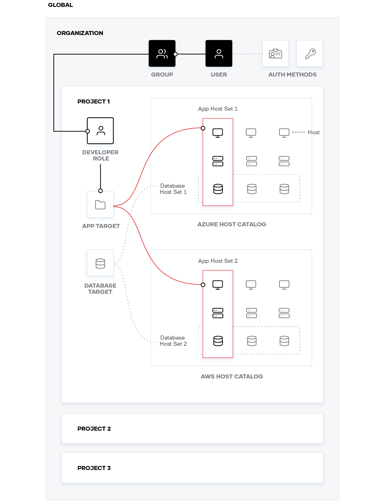

1. Click on the **Admin Console** tab to launch the Boundary admin console.

  

  

  If the admin console does not load for the first time, click the **Try again** link.
  

1. Enter `admin` as **Username** and `password` in the **Password** text
field to sign in.

1. Click **Authenticate** to log in.

1. Upon a successful authentication, you are on the **Organizations** page. Click on the **Generated org scope**.

1. Select **Roles**.

1. Select **Administration** and then click the **Principals** tab.

  Notice that `admin` user is listed. **User**, **group**, and **project** are a type of principal which can be assigned to roles.

1. Click on the **Grants** tab to view the permissions allowed on this role.

  Grants represent strings of actions on resources: `id=<resource_id>; action=<actions>`

  The grant for Administration role indicates that all actions (`actions=*`) on all resources (`id=*;type=*`) are permitted. Refer to the
  [documentation](http://www.boundaryproject.io/docs/concepts/security/permissions#permission-grant-formats) for more details.

1. Return to the **Roles** list and select **Login and Default Grants** role.

1. Click the **Grants** to view its permissions.

  A role can have multiple grants defined. Those grants are deleted when the role is deleted. A grant is also deleted if its associated resource is deleted.

1. Select **Projects** and then **Generated project scope**.

  Notice that you can see **Sessions**, **Targets** and **Host Catalogs**.

1. Select **Host Catalogs**.

1. Select **Generated host catalog**.

1. Click on the **Host Sets** tab and then **Generated host set** to view its details.

1. Click on the **Hosts** tab to view attached hosts.

  Currently, **Generated host** with ID, `hst_1234567890` is the only host attached to this host set. From the **Manage** menu, you can add or delete hosts from the host set.

1. Select **Generated host**. Its **Address** is set to `localhost`.

1. Select **Targets** from the left-pane.

1. Select **Generated target**.

  The **Generated target** allows TCP connection, and its ID is `ttcp_1234567890`.

  Using the **Manage** menu, you can add additional host sets to the target, or delete this target.

## Boundary Resource Summary

The relationships between hosts, host sets, and targets are as shown in the following diagram:

