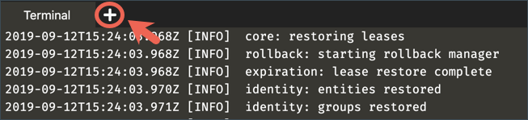

Click the **+** next to the opened Terminal, and select **Open New Terminal**.



In the **Terminal 2**, view the help message for `boundary authenticate` command.

```
boundary authenticate help
```{{execute T2}}

Authenticate with Boundary.

```
boundary authenticate password -auth-method-id=ampw_1234567890 \
      -login-name=admin -password=password \
      -keyring-type=none -format=json | jq -r ".item.attributes.token" > boundary_token.txt
```{{execute T2}}

The output suggests that token must be provided via `BOUNDARY_TOKEN` env var or `-token` flag.

```
Error opening keyring: Specified keyring backend not available
Token must be provided via BOUNDARY_TOKEN env var or -token flag. Reading the token can also be disabled via -keyring-type=none.
```

Set the `BOUNDARY_TOKEN` environment variable.  

```
export BOUNDARY_TOKEN=$(cat boundary_token.txt)
```{{execute T2}}

Read the details about the Generated target by its target ID which is `ttcp_1234567890`.

```
boundary targets read -id ttcp_1234567890
```{{execute T2}}

```
Target information:
  Created Time:               Wed, 28 Oct 2020 21:29:37 UTC
  Description:                Provides an initial target in Boundary
  ID:                         ttcp_1234567890
  Name:                       Generated target
  Session Connection Limit:   1
  Session Max Seconds:        28800
  Type:                       tcp
  Updated Time:               Wed, 28 Oct 2020 21:29:37 UTC
  Version:                    1

  Scope:
    ID:                       p_1234567890
    Name:                     Generated project scope
    Parent Scope ID:          o_1234567890
    Type:                     project

  Host Sets:
    Host Catalog ID:          hcst_1234567890
    ID:                       hsst_1234567890

  Attributes:
    Default Port:             22
```

Use the `boundary connect` command to SSH into the `localhost`.

```
boundary connect ssh -target-id ttcp_1234567890
```{{execute T2}}

At a prompt, "Are you sure you want to continue connecting (yes/no)?", enter `yes` to continue.

Return to the first **Terminal** to view the Boundary server log.

```
[INFO]  controller.worker-handler: session activated: session_id=s_XJmV49qjVM target_id=ttcp_1234567890 user_id=u_1234567890 host_set_id=hsst_1234567890 host_id=hst_1234567890
[INFO]  controller.worker-handler: authorized connection: session_id=s_XJmV49qjVM connection_id=sc_6zV0R2LIxq connections_left=0
[INFO]  controller.worker-handler: connection established: session_id=s_XJmV49qjVM connection_id=sc_6zV0R2LIxq client_tcp_address=127.0.0.1 client_tcp_port=44380 endpoint_tcp_address=::1 endpoint_tcp_port=22
```

<br />

Open a **new terminal**, and list current sessions.

```
boundary sessions list -scope-id=p_1234567890 \
    -token $(cat boundary_token.txt)
```{{execute T3}}

**Example output:**

```
Session information:
  ID:                 s_XJmV49qjVM
    Status:           active
    Created Time:     Wed, 28 Oct 2020 21:31:15 UTC
    Expiration Time:  Thu, 29 Oct 2020 05:31:15 UTC
    Updated Time:     Wed, 28 Oct 2020 21:31:15 UTC
    User ID:          u_1234567890
    Target ID:        ttcp_1234567890
```

The `ID` should match to what you saw in the Boundary server log (e.g. `session activated: session_id=s_XJmV49qjVM`).

Return to **Terminal 2** and exit out of the SSH session.

```
exit
```{{execute T2}}

A message, "Connection to 127.0.0.1 closed" displays.

Verify that the session is terminated.

```
boundary sessions list -scope-id=p_1234567890
```{{execute T2}}

The output should show the session status to be `terminated`.

```
Session information:
  ID:                 s_XJmV49qjVM
    Status:           terminated
    Created Time:     Wed, 28 Oct 2020 21:31:15 UTC
    Expiration Time:  Thu, 29 Oct 2020 05:31:15 UTC
    Updated Time:     Wed, 28 Oct 2020 21:36:51 UTC
    User ID:          u_1234567890
    Target ID:        ttcp_1234567890
```

<br />

## Exec command

The `boundary connect` can execute clients even when there is no built-in wrapper subcommand for it using `-exec`. The `-exec` flag is a very powerful tool, allowing you to wrap Boundary TCP sessions in your preferred client. You can use this flag to create an authenticated proxy to almost anything.


Let's update the default TCP target (`ttcp_1234567890`) port from `22` to `443` using the `boundary targets update` command.

```
boundary targets update tcp -default-port 443 -id ttcp_1234567890
```{{execute T2}}

Execute the cURL command using the `-exec` flag.

```
boundary connect -exec curl -target-id ttcp_1234567890 \
     -- -vvsL --output /dev/null hashicorp.com
```{{execute T2}}

```
* Rebuilt URL to: hashicorp.com/
*   Trying 76.76.21.21...
* TCP_NODELAY set
* Connected to hashicorp.com (76.76.21.21) port 80 (#0)
> GET / HTTP/1.1
> Host: hashicorp.com
> User-Agent: curl/7.58.0
> Accept: */*

...snip...
```
