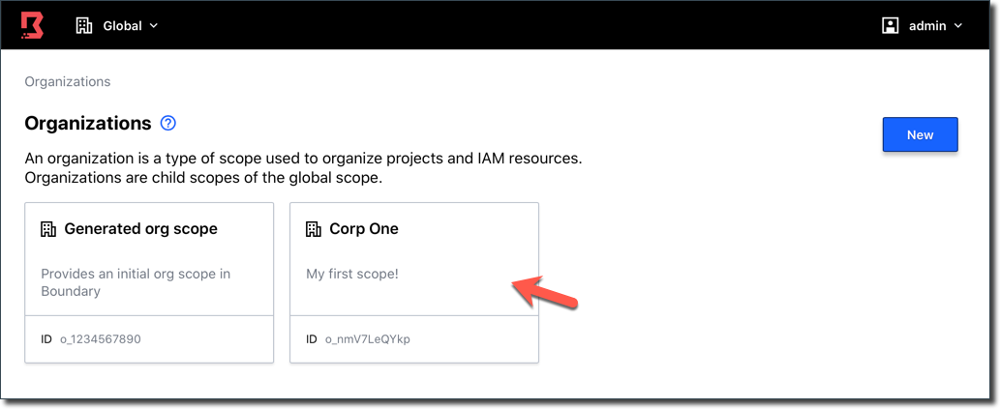

A Terraform configuration file (`main.tf`) is provided in the `terraform` directory.

To perform this task, you need to install Terraform.

```
sudo apt-get install terraform
```{{execute T2}}

Now, change the working directory to `terraform`.

```
cd terraform
```{{execute T2}}

Inspect the `main.tf` file contents.

```
cat main.tf
```{{execute T2}}

The provided Terraform will generate Boundary resources.

| Type          | Name      | Notes                                            |
|---------------|-----------|--------------------------------------------------|
| Organization  | Corp One  |  A new organization                              |
| Users         | (_multiple_) | Creates 9 users (Jim, Jeff, Randy, etc.)      |
| Group         | read-only | A new group with 3 users                         |
| Roles         | (_multiple_) | 2 new roles (**Read-only** and **admin**)     |
| Auth Method   | Corp Password | A new password auth method           |
| Project       | Core infrastrcture |  A new project within the **Corp One** organization |
| Host catalog  | backend_servers | A new host catalog with one host set       |
| Host set      | backend_servers_ssh | A new host set with 2 hosts            |
| Targets       | (_multiple_) | 2 new targets (**Backend servers** and **Backend service**) |


First, initialize Terraform.

```
terraform init
```{{execute T2}}

The `init` command downloads the latest available Terraform Provider for Boundary. Alternatively, you can clone the [Terraform Boundary Provider GitHub repository](https://github.com/hashicorp/terraform-provider-boundary) and build it from the source code. Refer to its README for more detail.

Run `terraform apply` and review the planned actions.

```
terraform apply -auto-approve
```{{execute T2}}

When it completes, it displays `Apply complete! Resources: 28 added, 0 changed, 0 destroyed`.


You can verify the configurations.

```
boundary scopes list
```{{execute T2}}

You should see a new scope, `Corp One` listed.

```
Scope information:
  ID:             o_1234567890
    Version:      1
    Name:         Generated org scope
    Description:  Provides an initial org scope in Boundary

  ID:             o_WHYhRSly10
    Version:      1
    Name:         Corp One
    Description:  My first scope!
```

Return to the Admin Console, select **Generated org scope > Global** to return to the organization selection page. Select the newly created **Corp One** organization to explore Boundary resources under Corp One.


