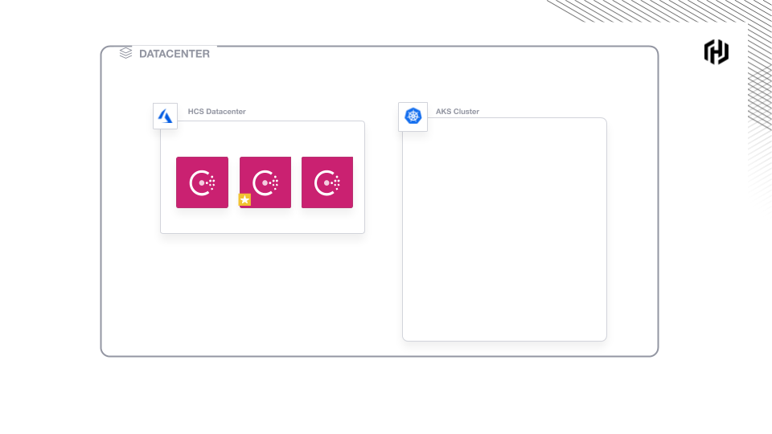

### Install the HCS on Azure extension

Click below to install the HCS Azure CLI extension.
This is required to manage HCS on Azure from the command line.

`az extension add --source https://releases.hashicorp.com/hcs/0.3.0/hcs-0.3.0-py2.py3-none-any.whl`{{execute T1}}

Click below when prompted.

`y`{{execute T1}}

### Personalize Your Environment

This diagram shows the starting state of your environment:



Open `personalize.sh`{{open}} and **set your username, login secret, and tenant id**
on lines 1-3.

The script will login you into Azure, and set environment
variables to ensure you are connected to your own sandbox.

`bash personalize.sh`{{execute T1}}

Example Output:

```shell-session
export RESOURCE_GROUP=dwcc-username-rg
...TRUNCATED
export HCS_MANAGED_APP=dwcc-username-managed-hcs
```

### Validate Environment

Source the updated `.bashrc`.

`source $HOME/.bashrc`{{execute T1}}

Review all the resources in your environment.

`az resource list --resource-group $RESOURCE_GROUP | jq -r '.[] | .name'`{{execute T1}}

Example output:

```shell-session
dwcc-username--aks
dwcc-username-vnet
dwcc-username-managed-hcs
```

Verify you can connect to AKS.

`kubectl get pods -n kube-system`{{execute T1}}
