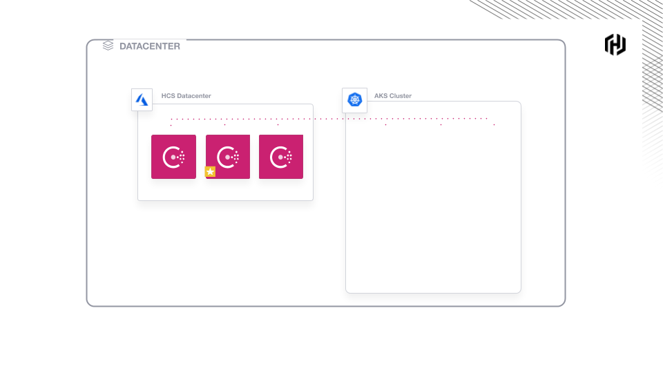

### Enable Peering

Enable VNet Peering between HCS and AKS.

`bash peering.sh`{{execute T1}}

Now, your environment looks like this.



### Create the Kubernetes Secrets

Bootstrap Consul ACLs and store the token
as a Kubernetes secret.

`az hcs create-token --name $HCS_MANAGED_APP --resource-group $RESOURCE_GROUP --output-kubernetes-secret | kubectl apply -f -`{{execute T1}}

Example output:

```plaintext
secret/dwcc-username-managed-hcs-bootstrap-token created
```

Generate a Kubernetes secret with the gossip key
and CA Cert for HCS.

`az hcs generate-kubernetes-secret --name $HCS_MANAGED_APP --resource-group $RESOURCE_GROUP | kubectl apply -f -`{{execute T1}}

Example output:

```plaintext
secret/dwcc-username-managed-hcs created
```
