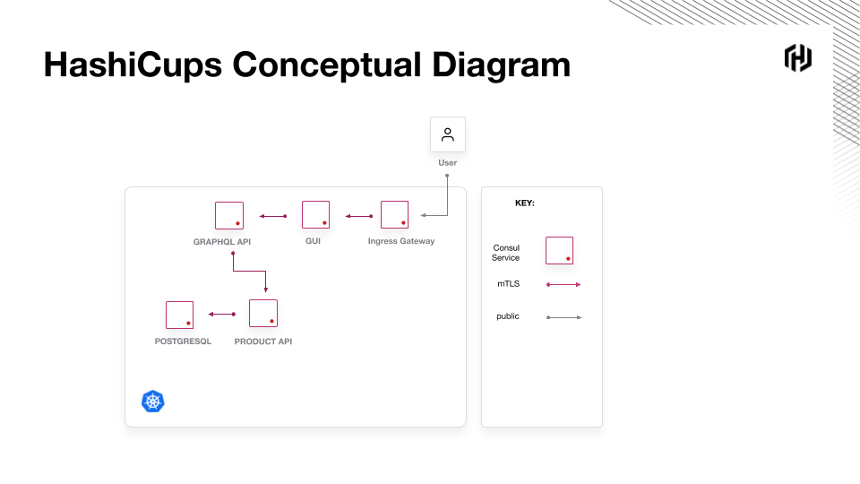
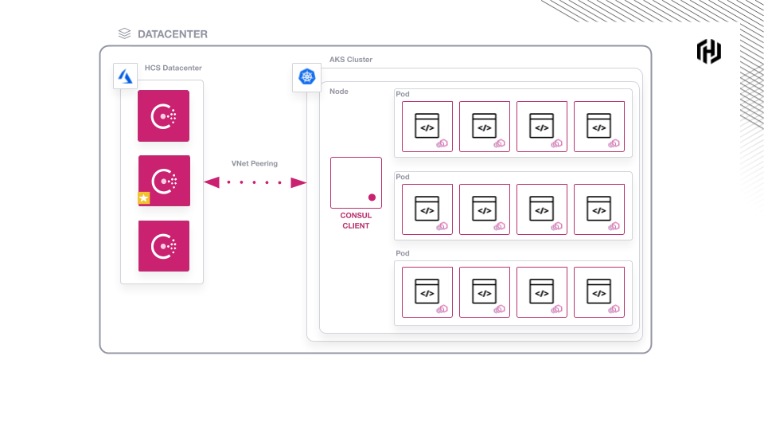

### Deploy the HashiCups Application

The HashiCups application consists of the following services:



Deploy the workload to AKS.

`kubectl apply -f hashicups/ --wait`{{execute interrupt T1}}

Example output:

```plaintext
service/frontend created
serviceaccount/frontend created
...TRUNCATED
```

Check that the workload is deployed and running.

`watch kubectl get pods`{{execute T1}}

The deployment is complete when all pods are Ready with a
status of `Running`.

Example output:

```plaintext
NAME                                         READY   STATUS    RESTARTS   AGE
consul-5nmmx                                 1/1     Running   0          6m4s
consul-connect-injector-webhook-deployment   1/1     Running   0          6m4s
frontend                                     3/3     Running   0          2m5s
postgres                                     3/3     Running   0          2m4s
products-api                                 3/3     Running   0          2m5s
public-api                                   3/3     Running   0          2m4s
```

Now your environment looks like this:

