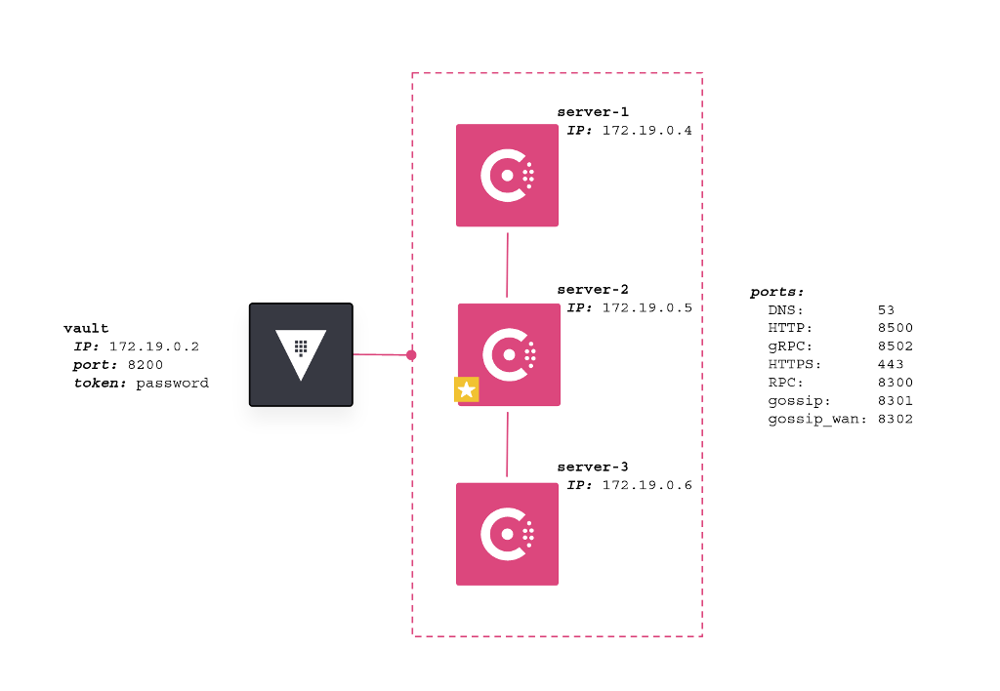

There are a few components that need to be added to the environment; we are
adding them now. Wait for the complete message and then move to the
next step.

The provision will end with the following message:

```
Complete!  Move on to the next step.
```

After that message you can continue with the lab.

The diagram below shows the infrastructure that is provisioned by the lab.



The Consul datacenter is configured in a secure fashion with:
* Gossip encryption enabled
* TLS encryption enabled and certificates generated using Vault
* Consul Connect service mesh enabled and certificates generated using Vault
* ACLs enabled and bootstrapped

At the end of the provision you can examine the commands issued for the 
configuration by viewing `./logs/provision.log`{{open}}
