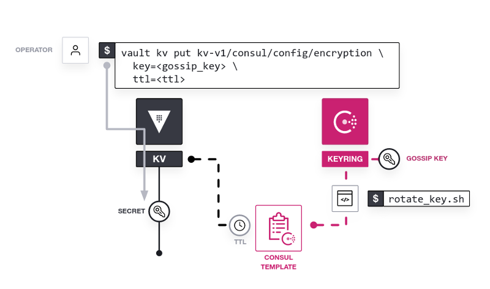

# Secure Consul Gossip encryption using Vault

In this hands-on lab, you enable gossip encryption
in Consul using Vault to store and retrieve the encryption key.

Specifically, you will:

- Start a Vault dev instance
- Enable the KV store in Vault
- Generate a gossip key for Consul
- Store the gossip key as a secret in Vault
- Retrieve the gossip key from Vault
- Configure and start Consul
- Use consul-template to automate gossip key rotation

If you are already familiar with the basics of Consul,
[Secure Gossip Communication with Encryption](https://learn.hashicorp.com/tutorials/consul/gossip-encryption-secure)
provides a reference guide for the steps required to
enable gossip encryption on both new and existing datacenters.
