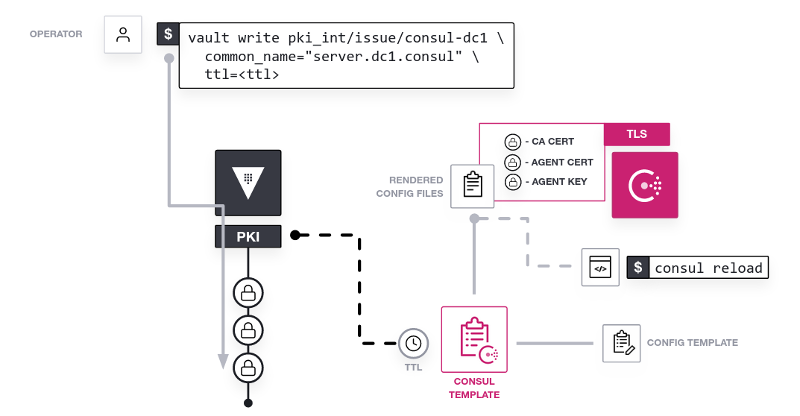

# Secure Consul Agent Communication with TLS

In this hands-on lab, you will deploy a Consul datacenter that uses Vault to generate and manage certificates to secure agent communication.

This lab will guide you through the steps necessary to deploy Consul with TLS encryption enabled to secure agent-to-agent communication including RPC requests and the consensus protocol.

Specifically, you will:

- Start a Vault dev instance
- Create a policy in Vault to allow certificate generation
- Enable the PKI secrets engine in Vault
- Initialize the CA and generate an intermediate certificate
- Generate certificates for your Consul servers
- Use consul-template to retrieve certificates at runtime
- Perform a certificate rotation

If you are already familiar with the basics of Consul, but are not familiar with TLS encryption review the [Secure Consul Agent Communication with TLS Encryption](https://learn.hashicorp.com/tutorials/consul/tls-encryption-secure?in=consul/secure-production) tutorial. 
