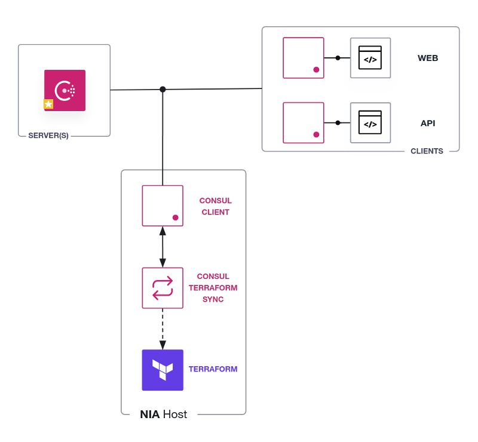

# Network Interface Automation with Consul-Terraform-Sync

In this hands-on lab, you will deploy a Consul datacenter,
install Consul-Terraform-Sync, and use it to monitor changes in the service
catalog.

Specifically, you will:

- Deploy a containerized Consul datacenter with Docker
- Check the health of the datacenter nodes and services
- Install Consul-Terraform-Sync
- Configure Consul-Terraform-Sync
- Review the Consul-Terraform-Sync configuration
- Run Consul-Terraform-Sync
- Verify services data retrieved from the Consul catalog
- Use the `/status` API to get information on the task run
- Change a service definition
- Verify Consul-Terraform-Sync intercepts the change