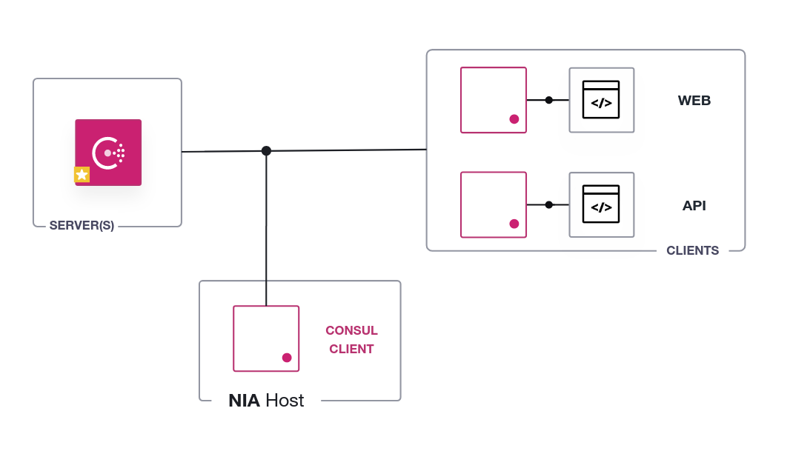

There are a few components that need to be added to the environment; we are
adding them now. Wait for the complete message and then move to the
next step.

When this phase completes you'll have a consul datacenter with:
- One server node
- Two client nodes each one running a service
- A consul client running on the host and connected to the datacenter



**Example Output**

```screenshot
- Install prerequisites
...
```

and concluding with

```
- Complete! Move on to the next step.
```

Once this message appears, you are ready to continue.