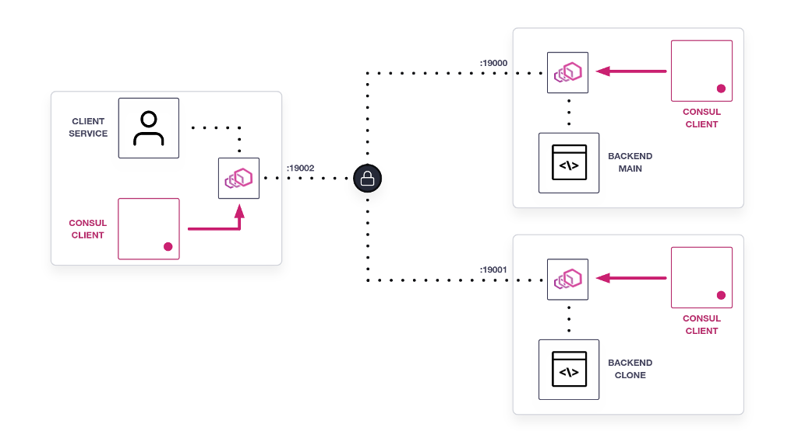

There are a few components that need to be added to the environment; we are
adding them now. Wait for the complete message and then move to the
next step.

**Example Output**

```screenshot
 - Install prerequisites
 - Pulling Docker Image
 - Creating Docker volumes
 - Copying configuration files
 - Starting Consul Server
 ...
 - Starting Consul Clients
 ...
 - Starting Ingress Gateway
 ...
 ...
 - Starting Applications and configuring service mesh
 - Complete! Move on to the next step.
```

and concluding with

```
- Complete! Move on to the next step.
```

Once this message appears, you are ready to continue.

## Architecture for the lab



### Configuration files

While you wait for the environment to complete deploy you can review the files you are going to use for this lab later:

| File                              | Description |
|-----------------------------------|-------------|
| `server.hcl`              | Server agent configuration file |
| `agent.hcl`               | Client agent configuration file|
| `default.hcl`             | Service defaults configuration |
| `hash-resolver.hcl`       | Maglev load balancing policy definition |
| `igw-backend.hcl`         | Ingress Gateway central configuration | 
| `least-req-resolver.hcl`  | Least request load balancing policy definition|
| `svc-client.hcl`          | Service configuration file for `client`|
| `svc-clone.hcl`           | Service configuration file for `backend-clone`|
| `svc-main.hcl`            | Service configuration file for `backend-main`|
