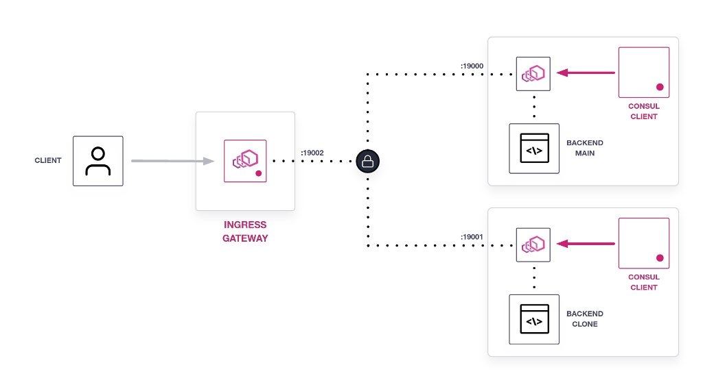

The load balancing policy for the service sidecar proxies also applies to the service resolution performed by ingress gateways. Once you configured the policies for the services and tested it internally using the client service, you can introduce an ingress gateway in your configuration and the same policies will be now respected by external requests being served by your Consul datacenter.

<!--Arch diagram-->


In this lab you can access the service from your browser using the [ingress gateway](https://[[HOST_SUBDOMAIN]]-8080-[[KATACODA_HOST]].environments.katacoda.com/).

By refreshing the page in your web browser you can verify that the request is being balanced between both instances of the service.

To test the load balancing policy on ingress gateways you can re-enable the sticky session for service resolution.

You can reuse the `hash-resolver.hcl`{{open}} file and apply the policy using the `consul config` command.

`docker exec server consul config write /etc/consul.d/hash-resolver.hcl`{{execute}}

Example output:

```
Config entry written: service-resolver/backend
```

### Verify the policy is applied

Once the policy is in place you can test it using the `curl` command and applying the `x-user-id` header to the request:

`curl -s backend.ingress.consul:8080 -H "x-user-id: 12345"`{{execute}}

Example output:

```
{
  "name": "main",
  "uri": "/",
  "type": "HTTP",
  "ip_addresses": [
    "172.18.0.4"
  ],
  "start_time": "2020-10-01T19:11:57.250151",
  "end_time": "2020-10-01T19:11:57.250581",
  "duration": "430.088µs",
  "body": "Hello World",
  "code": 200
}
```

Execute the curl command multiple times you, will always be redirected to the same instance of the _backend_ service.

`curl -s backend.ingress.consul:8080 -H "x-user-id: 12345"`{{execute}}
