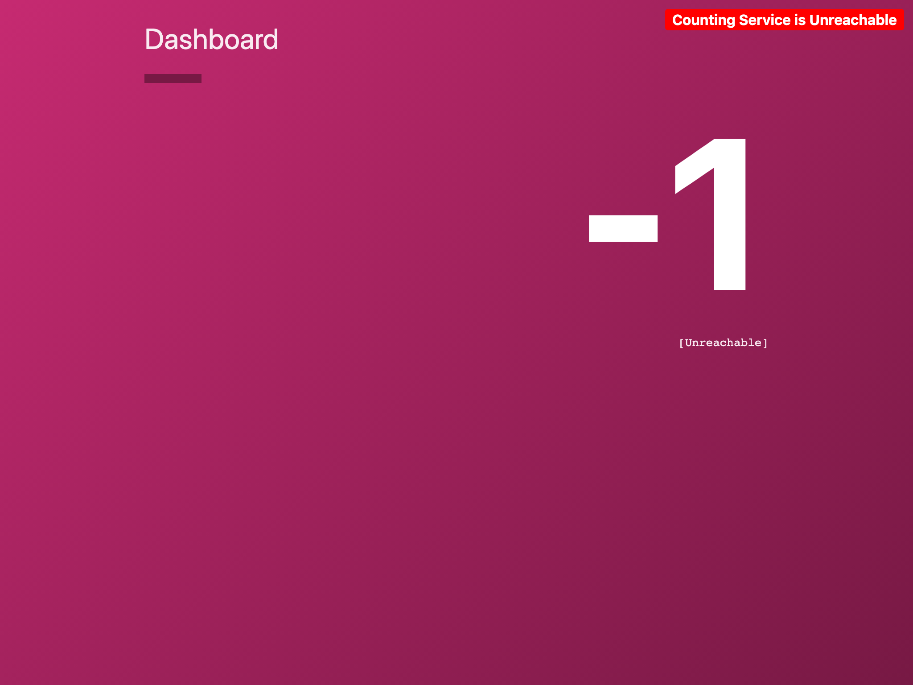
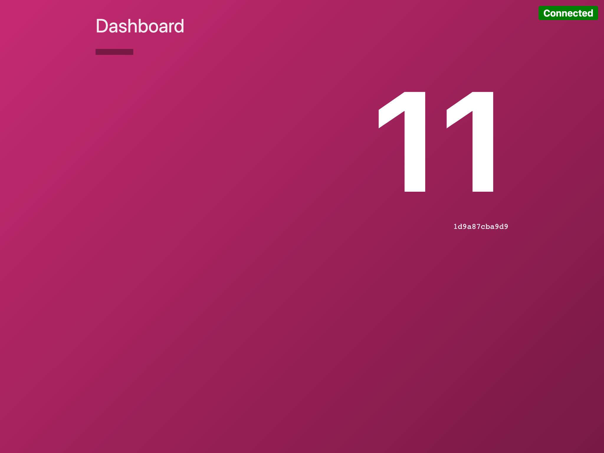

Open the Countdash interface by clicking the "Countdash UI" tab above the
terminal. The countdash application has a dashboard service that connects to
its API service. The API service tracks visits and increments a counter.


## Deny traffic between the services

Verify that the counting service is connecting to the API service over the
service mesh by changing the intention that you created in the previous step to
a `deny` intention.

Run `consul intention create -replace -deny count-dashboard count-api`{{execute}}.
The command returns to the shell prompt with no output. Watch the dashboard and
note that it is now unable to connect to the API service.



## Re-allow the traffic

Replace your intention with an `allow` intention.

```shell
consul intention create -replace -allow count-dashboard count-api
```{{execute}}

Verify that the dashboard reconnects to the API and starts counting again.




## Stop the Countdash application

Once you are done, run `nomad stop countdash`{{execute}} to prepare for the next
step.

**Example Output**

```screenshot
$ nomad stop countdash
==> Monitoring evaluation "d4796df1"
    Evaluation triggered by job "countdash"
    Evaluation within deployment: "18b25bb6"
    Evaluation status changed: "pending" -> "complete"
==> Evaluation "d4796df1" finished with status "complete"
```

