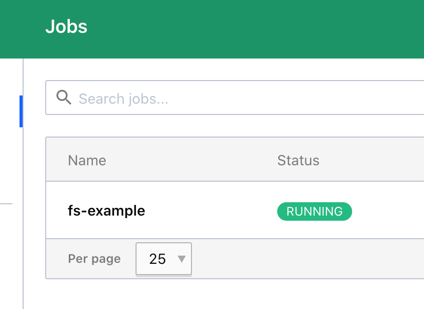
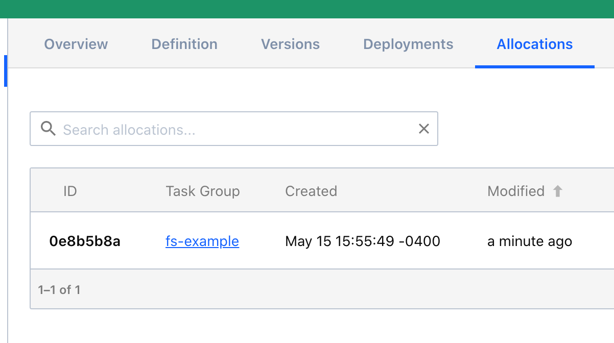
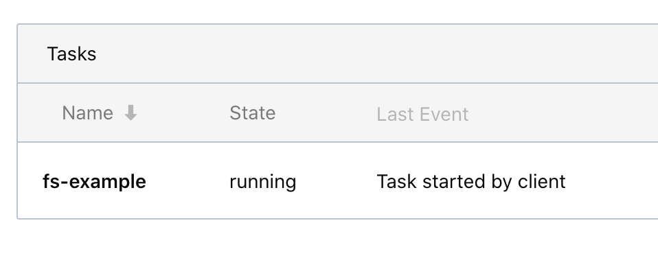
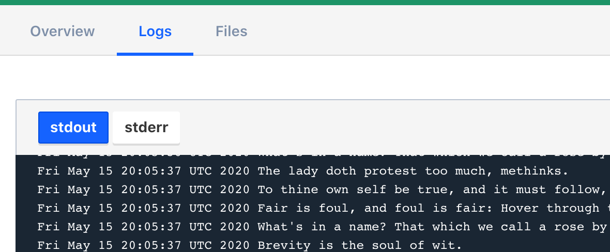
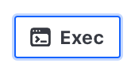
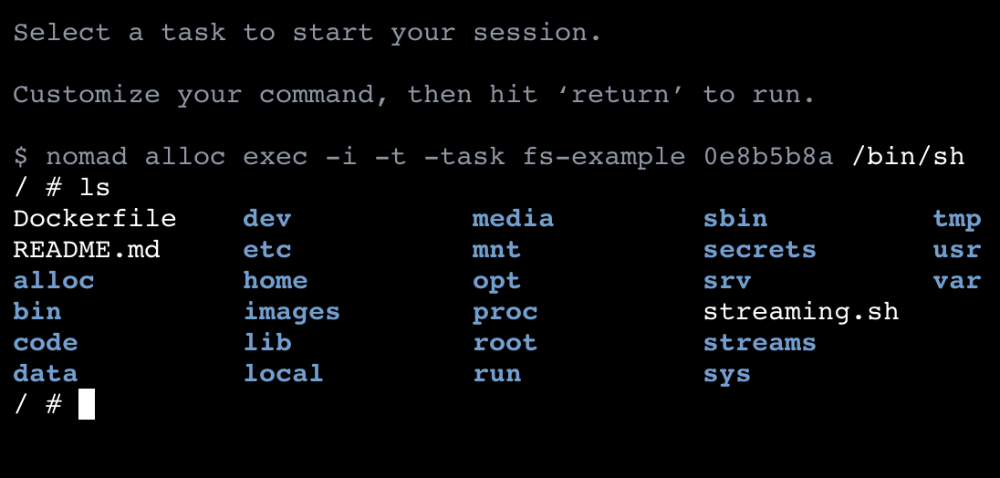

If you haven't already, open the [Nomad UI↗️]. This will open in a new
tab. Consider dragging the tab into its own window and arranging your
screen so that you can see the scenario and the UI window at the same time.

View the **fs_example** job by clicking on it in the Name column.

Click on **Allocations** in the top bar and then click on the allocation ID
which is the first element in the Allocation table. Your ID will be different
for each instance of the job.

Navigate to the fs-example task in the Tasks table. Click it to open the
specific task.

Click on the Logs tab to view the logs for the allocation.

Click back to the "Overview" tab, then click the "Exec" button on the top right
to open an exec window to the fs-example task.

Change the default command ("/bin/bash") to `/bin/sh` and press <key>Enter</key>

Run the `ls` command.

[Nomad UI↗️]: https://[[HOST_SUBDOMAIN]]-4646-[[KATACODA_HOST]].environments.katacoda.com/
