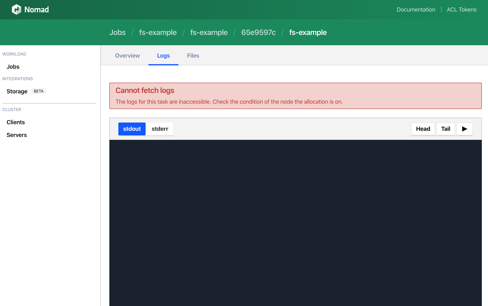

When possible, the Web UI will use a streaming HTTP request to stream logs on the
task logs page. NGINX will buffer proxy responses by default in an attempt to
free up connections to the backend server being proxied as soon as possible.

Proxy buffering causes logs events to not stream because they will be
temporarily captured within NGINX's proxy buffer until either the connection is
closed or the proxy buffer is filled and the data is finally flushed
to the client.

Older browsers may not support this technology, in which case logs are streamed
using a simple polling mechanism.

To observe this issue, visit the task logs page of your sample job by first
visiting the [sample job], then clicking the most recent allocation, then
clicking the `fs-example` task, then clicking the logs tab.

Logs will not load and eventually the following error will appear in the UI.



There will also likely be an additional error in the browser developer tools
console.

```plaintext
GET http://internal-ip:4646/v1/client/fs/logs/131f60f7-ef46-9fc0-d80d-29e673f01bd6?follow=true&offset=50000&origin=end&task=ansi&type=stdout net::ERR_NAME_NOT_RESOLVED
```

Errors from requests pointing to the Nomad client's internal addresses can be
safely ignored. To prevent streaming logs through Nomad server nodes when
unnecessary, the Web UI optimistically attempts to connect directly to the
client node the task is running on. Since the Nomad configuration file used in
this guide specifically advertises an address that can't be reached, the UI
automatically falls back to requesting logs through the proxy.

The NGINX configuration needs to be updated to disable proxy buffering, and
allow log streaming.

Add the following to the top of the `location` block of the existing NGINX
configuration file.

<pre class="file" data-filename="nginx.conf" data-target="insert" data-marker="    location / {">
    location / {
      # Nomad log streaming uses streaming HTTP requests. In order to
      # synchronously stream logs from Nomad to NGINX to the browser
      # proxy buffering needs to be turned off.
      proxy_buffering off;
</pre>

Restart the NGINX docker container to load these configuration changes.

```
docker restart nomad-proxy
```{{execute}}

[sample job]: https://[[HOST_SUBDOMAIN]]-8000-[[KATACODA_HOST]].environments.katacoda.com/jobs/fs-example`
[img-cannot-fetch-logs]: ./assets/img-cannot-fetch-logs.png
