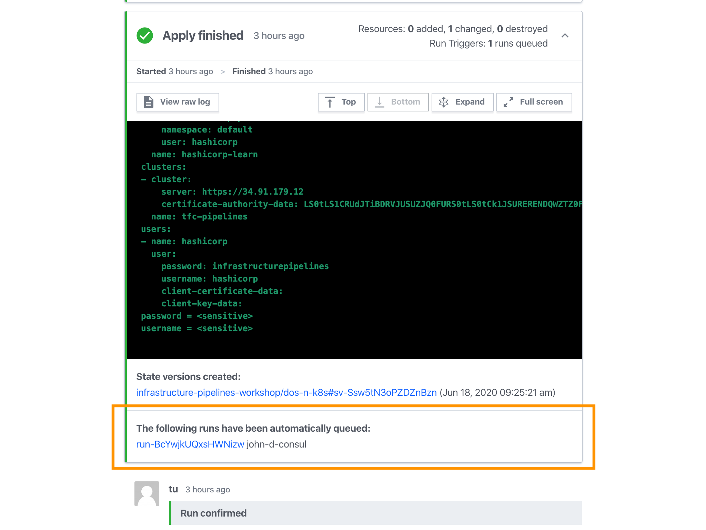

## Deploy Kubernetes, Consul, and Vault

Now that you have successfully configured all three workspaces (Kubernetes,
Consul, and Vault), you can deploy your Consul instance and Vault instance.

Verify that your Kubernetes cluster workspace has been successfully applied
before starting this step. In Terraform Cloud, navigate to your [list of
workspaces](https://app.terraform.io/app/infrastructure-pipelines-workshop/workspaces),
and look for "APPLIED" in the Run Status column for your Kubernetes workspace.

## Enable Consul and Vault

Now that your Kubernetes cluster has been provisioned, you will deploy Consul
and Vault on your cluster.

In Terraform Cloud, navigate to your Kubernetes workspace. Click on "Variables",
and then set the Terraform variable `enable_consul_and_vault` to `true`.

1. Click on the "three dots" icon next to the "enable_consul_and_vault"
   variable.
1. Choose "Edit".
1. Change the Value to "true".
1. Click "Save variable".

Use the "Queue plan manually" interface to queue another plan step. In the plan
output UI, note that the "node_count" will scale from 3 to 5 nodes. Use the
"Confirm & Apply" interface to apply the plan and scale your Kubernetes cluster.

This process should take about 5 minutes to complete.

Notice that a plan for your Consul workspace will be automatically queued once the apply completes.

## Deploy Consul

In Terraform Cloud, navigate to the Consul workspace, view the run plan, then
use the "Confirm & Apply" interface to confirm the plan. This will deploy Consul
onto your cluster using the Helm provider. The plan retrieves the Kubernetes
cluster authentication information from the Kubernetes workspace to configure
both the Kubernetes and Helm provider.

This process will take about 2 minutes to complete.

Notice that a plan for your Vault workspace will be automatically queued once
the apply completes.

## Deploy Vault

Navigate to the Vault workspace, view the run plan, then use the "Confirm &
Apply" interface to apply the plan. This will deploy Vault onto your cluster
using the Helm provider and configure it to use Consul as the backend. The plan
retrieves the Kubernetes namespace from the Consul workspace’s remote state and
deploys Vault to the same workspace.

This process will take about 2 minutes to complete.

## Next steps

You have now successfully applied all three of your workspaces, deploying Vault
and Consul on your Kubernetes cluster.

In the next step, you will verify the deployments by using kubectl to manage
your Kubernetes cluster.
