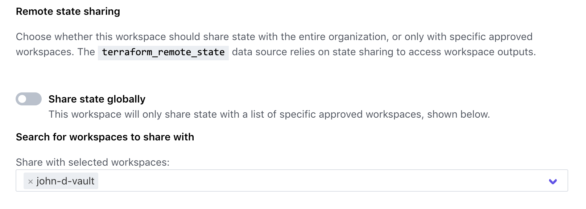

## Configure the Consul workspace

Configure the Consul GitHub repository and workspace by following a similar set
of sets as you did for your Kubernetes workspace.

1. Fork the [Learn Terraform Pipelines Consul
   repository](https://github.com/hashicorp/learn-terraform-pipelines-consul)
   into your own GitHub account using the `fork` interface in GitHub.
1. In your forked repository, switch to the `hashiconf-workshop` branch.
  
1. In the `hashiconf-workshop` branch, navigate to `main.tf`.
1. Use the "pencil"/edit button to edit the file.
1. Replace the `organization` and `workspaces` values with the organization set
   up for this workshop ("infrastructure-pipelines-workshop"), and your unique
   workspace name ("{firstName}-{lastInitial}-consul"). <br/>
1. Commit your changes directly to the "hashiconf-workshop" branch of your forked
   repository.

The `main.tf` file should look similar to the following.

```
terraform {
  backend "remote" {
    organization = "infrastructure-pipelines-workshop"

    workspaces {
      name = "john-d-consul"
    }
  }
}
```

Now that your GitHub repository is configured for use with the Terraform Cloud
workspace, connect them in the Terraform Cloud UI.

### Connect workspace to forked repository

Visit the [Terraform Cloud
UI](https://app.terraform.io/app/infrastructure-pipelines-workshop).

1. Select your Consul workspace ("john-d-consul").
1. Within the workspace UI, click on "Settings" and then "Version Control".
  
1. Click on "Connect to version control" and choose "Version control workflow".
1. Select "Github".
1. Select your **forked** Consul repository:
  `{your-github-username}/learn-terraform-pipelines-consul`
  - **Note:** If you have already authorized Terraform Cloud to access selected
    GitHub repositories, but not all of your repositories, the Consul
    repository may not appear on this list. If so, follow the instructions under
    "Grant access to specific GitHub repositories" below.
1. Set the "VCS branch" to be `hashiconf-workshop`.
1. Select "Include submodules on clone" to include the GitHub submodule for Helm included in the repository.
  
1. Click "Update VCS settings" to connect this workspace to your forked GitHub
   repository.

<details style="padding-bottom: 1em;">
<summary>Grant access to specific GitHub repositories</summary>
<br/>
If your forked repository does not appear in the list of repositories above,
follow these steps to grant Terraform Cloud access to the repository.<br/>
<br/>
<ol type="1">
  <li>Log in to [GitHub](https://github.com).</li>
  <li>Navigate to your user profile settings by clicking on your profile picture in
   the upper right, and choosing "Settings" from the menu.</li>
  <li>On the settings page, select "Applications" from the menu on the left.</li>
  <li>
    "Terraform Cloud" should be listed here. Click the "Configure" button next to it.
    <ul>
      <li>If "Terraform Cloud" does not appear, then Terraform Cloud has not been
    configured to access GitHub. Return to Terraform Cloud to connect it to
    GitHub as described above.</li>
    </ul>
  </li>
  <li>On the next page, you can either grant Terraform Cloud access to all of your
   GitHub repositories, or use the "Only select repositories" interface to
   select the repository you forked earlier.</li>
  <li>If you only grant access to select repositories, you will need to repeat the
   last step for all three of the repositories used in this workshop.</li>
</ol>
</details>

The Consul repository uses a GitHub submodule for Helm. In addition to the steps
above, configure Terraform Cloud to load this submodule.

### Share remote state

Share your Consul workspace's state with your Vault workspace. This will allow
it to access output values from your Consul workspace.

1. Within the workspace UI, click on "Settings" and then "General".
1. Scroll down to "Remote state sharing".
1. Select your Vault (eg, "john-d-vault") workspace.
1. Click "Save settings" to share your Consul workspace's state, including
   output values, with your Vault workspace.



### Verify variables

Next, click on "Variables". Your Terraform Variables will already be set for
you. These correspond with the variables in
[`variables.tf`](https://github.com/hashicorp/learn-terraform-pipelines-consul/blob/master/variables.tf).

#### Terraform Variables

- **organization** - Organization of workspace that created the Kubernetes cluster<br/>
  This will be set to `infrastructure-pipelines-workshop`.
- **namespace** — Kubernetes namespace to deploy the Consul Helm chart<br/>
  This will be set to `hashicorp-learn`. You will use this to access your Consul
  and Vault instances later.
- **release_name** — Helm Release name for Consul chart<br/>
  This will be set to `hashicorp-learn`. Your Vault pods will start with this
  release name.
- **cluster_workspace** — Workspace that created the Kubernetes cluster<br/>
  This will be set to something similar to `{firstName}-{lastInitial}-k8s`
  (`john-d-k8s`).

### Enable run trigger

In the Workspace UI, click on "Settings" and then select "Run Triggers".

Under "Source Workspaces", select your Kubernetes workspace ("john-d-k8s") then
click "Add Workspace".


Setting a run trigger means that whenever the Kubernetes workspace is applied,
Terraform Cloud will trigger an apply run on the consul workspace.

## Next steps

You have successfully configured your Consul workspace. The pipeline will
retrieve the Kubernetes credentials from the Kubernetes workspace to
authenticate to the Kubernetes and Helm provider.

In the next step, you will configure your Vault workspace. You don't need to
wait for the Consul workspace before moving on.
