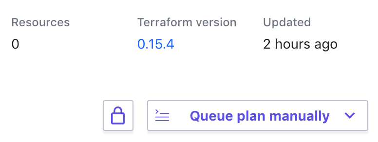

## Setup Terraform Cloud workspaces

In the next few steps, you will locate your pre-configured workspaces
(Kubernetes, Consul, and Vault) in Terraform Cloud. Then you will connect them
to a version control system (VCS), verify the variables are set up properly, and
set up run triggers connecting the workspaces.

Check the email address you used to sign up for the workshop. You should find an
invitation to join the `infrastructure-pipelines-workshop` organization in
Terraform Cloud. Accept this invitation and login to [Terraform
Cloud](https://app.terraform.io/app/infrastructure-pipelines-workshop). Within
the workshop organization, you will find 3 workspaces starting with your first
name and middle initial. For example, if your name is John Doe, you should see:

- `john-d-k8s`
- `john-d-consul`
- `john-d-vault`

You will use these three workspaces for the rest of this workshop.

## Configure the Kubernetes workspace

You will need to create your own forks of the repositories used in this
workshop, and configure your Terraform Cloud workspaces to use them. Start with
the Kubernetes repository and workspace.

1. Fork the [Learn Terraform Pipelines K8s
   repository](https://github.com/hashicorp/learn-terraform-pipelines-k8s) into
   your own GitHub account using the `fork` interface in GitHub.
1. In your forked repository, switch to the `hashiconf-workshop` branch.
  
1. In the `hashiconf-workshop` branch, navigate to `main.tf`.
1. Use the "pencil"/edit button to edit the file.
  
1. Replace the `organization` and `workspaces` values with the organization set
   up for this workshop ("infrastructure-pipelines-workshop"), and your unique
   workspace name ("{firstName}-{lastInitial}-k8s").<br/>
1. Commit your changes directly to the "hashiconf-workshop" branch of your forked
  repository.

Your `main.tf` file should look similar to the following.

```
terraform {
  backend "remote" {
    organization = "infrastructure-pipelines-workshop"

    workspaces {
      name = "john-d-k8s"
    }
  }
}
```

Now that your GitHub repository is configured for use with the Terraform Cloud
workspace, connect them in the Terraform Cloud UI.

### Connect workspace to forked repository

Visit the [Terraform Cloud
UI](https://app.terraform.io/app/infrastructure-pipelines-workshop).

1. Select your Kubernetes workspace ("john-d-k8s").
1. Within the workspace UI, click on "Settings" and then "Version Control".
  
1. Click on "Connect to version control" and choose "Version control
   workflow".
1. Select "Github".
  - If this is your first time using Terraform Cloud with GitHub, it will ask
    you to authorize Terraform Cloud to access GitHub.
1. Select your forked Kubernetes repo:
  `{your-github-username}/learn-terraform-pipelines-k8s`
  - **Note:** If you have already authorized Terraform Cloud to access selected
    GitHub repositories, but not all of your repositories, the Kubernetes
    repository may not appear on this list. If so, follow the instructions under
    "Grant access to specific GitHub repositories" below.
1. Set the "VCS branch" to be `hashiconf-workshop`.
  .
1. Click "Update VCS settings" to connect this workspace to your forked GitHub repository.

<details style="padding-bottom: 1em;">
<summary>Grant access to specific GitHub repositories</summary>
<br/>
If your forked repository does not appear in the list of repositories above,
follow these steps to grant Terraform Cloud access to the repository.<br/>
<br/>
<ol type="1">
  <li>Log in to [GitHub](https://github.com).</li>
  <li>Navigate to your user profile settings by clicking on your profile picture in
   the upper right, and choosing "Settings" from the menu.</li>
  <li>On the settings page, select "Applications" from the menu on the left.</li>
  <li>
    "Terraform Cloud" should be listed here. Click the "Configure" button next to it.
    <ul>
      <li>If "Terraform Cloud" does not appear, then Terraform Cloud has not been
    configured to access GitHub. Return to Terraform Cloud to connect it to
    GitHub as described above.</li>
    </ul>
  </li>
  <li>On the next page, you can either grant Terraform Cloud access to all of your
   GitHub repositories, or use the "Only select repositories" interface to
   select the repository you forked earlier.</li>
  <li>If you only grant access to select repositories, you will need to repeat the
   last step for all three of the repositories used in this workshop.</li>
</ol>
</details>

### Share remote state

Share your Kubernetes workspace's state with your other two workspaces. This
will allow them to access output values from your Kubernetes workspace.

1. Within the workspace UI, click on "Settings" and then "General".
1. Scroll down to "Remote state sharing".
1. Select your Vault (eg, "john-d-vault") and Consul ("john-d-consul") workspaces.
1. Click "Save settings" to share your Kubernetes workspace's state, including
   output values, with the other two.


### Verify variables

Next, click on "Variables" in the workspace UI. Both the Terraform Variables and
Environment Variables will already be set for you.

#### Terraform Variables

These variables correspond to the variables declared in
[`variables.tf`](https://github.com/hashicorp/learn-terraform-pipelines-k8s/blob/master/variables.tf).

- **username** — Username for Kubernetes cluster<br/>
  This can be anything, but defaults to `hashicorp`.
- **enable_consul_and_vault** — Enable Consul and Vault for the secrets cluster<br/>
  This will be set to `false`. This variable dictates whether Consul and Vault
  should be deployed on your Kubernetes cluster.
- **cluster_name** — Name of Kubernetes cluster<br/>
  This will be set to `tfc-pipelines`.
- **region** — GCP region to deploy clusters<br/>
  This will be set to `europe-west4`. For a full list of GCP regions, refer to [Google’s Region and Zones documentation](https://cloud.google.com/compute/docs/regions-zones).
- **password** — Password for Kubernetes cluster<br/>
  This can be anything over 16 characters, but for this workshop it defaults to
  `infrastructurepipelines`, and will be marked **sensitive**.
  Terraform will set this when it creates your Kubernetes cluster and will
  distribute it as necessary when creating your Consul and Vault clusters. You
  will not need to manually input this value.
- **google_project** — Google Project to deploy cluster<br/>
  This is the Google Cloud project for your infrastructure, and will be set to
  something similar to `{firstName}-{lastInitial}-{randomString}`.

#### Environment Variables

The Terraform Google Cloud provider will use these credentials to authenticate
with the Google Cloud API.

- **GOOGLE_CREDENTIALS** — Flattened JSON of your GCP credentials.<br/>
  This will already been set for you and marked **sensitive**. These credentials
  have access to both the **Compute Admin** and **GKE Admin** roles.

## Deploy the Kubernetes cluster

Use the `Queue plan manually` interface in Terraform Cloud to queue a plan for your
workspace.



If the plan is successful, Terraform Cloud will ask you to confirm and apply.

Click "Confirm & Apply" to apply this configuration. This process should take
about 10 minutes to complete. 

While your Kubernetes cluster is being deployed, continue on to the next step
and configure your Consul workspace.

## Next steps

You have successfully configured your Kubernetes workspace. Terraform Cloud will
use the configuration provided in your GitHub repository to deploy your
Kubernetes cluster. The Kubernetes workspace will output the Kubernetes
credentials for the Helm charts to consume in the Consul and Vault workspaces.
These output values are defined in the Kubernetes GitHub repository in
[`outputs.tf`](https://github.com/hashicorp/learn-terraform-pipelines-k8s/blob/master/outputs.tf).

In the next step, you will configure your Consul workspace in a similar fashion.
