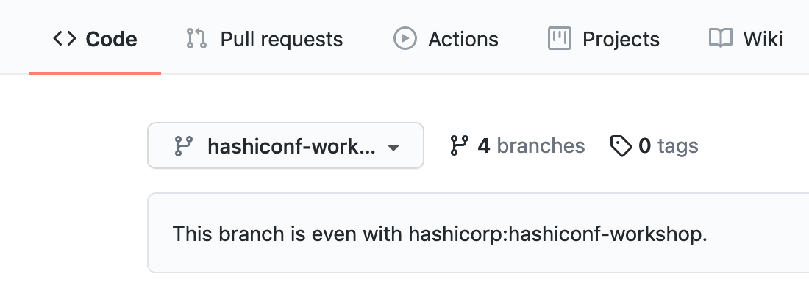
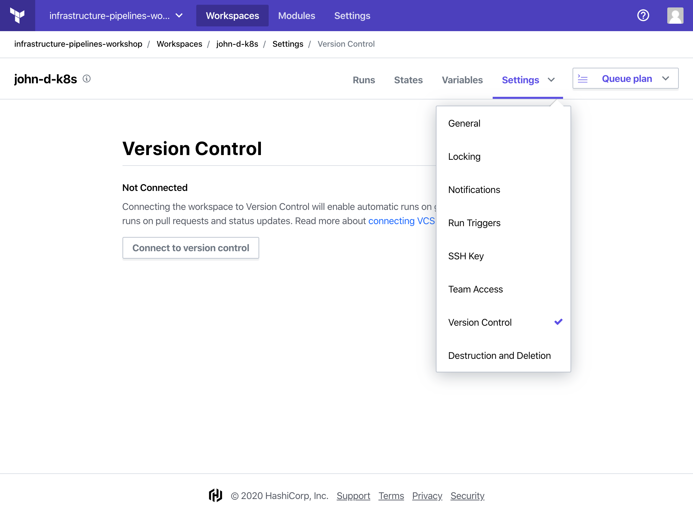
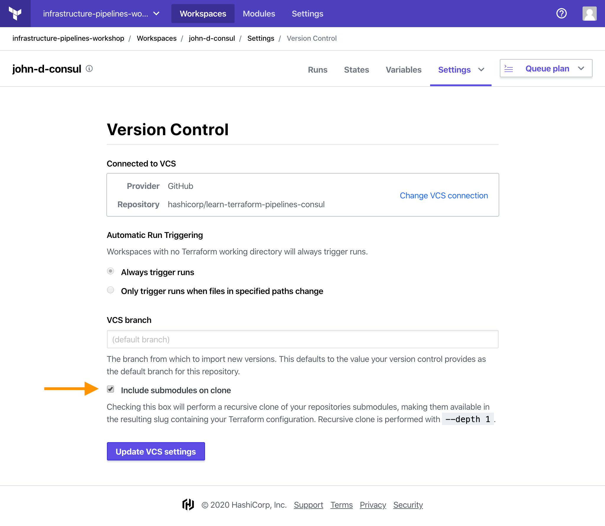

## Configure the Vault workspace

Once again, the steps to configure your Vault workspace will be similar to the
previous two workspaces.

1. Fork the [Learn Terraform Pipelines Vault
   repository](https://github.com/hashicorp/learn-terraform-pipelines-vault)
   into your own GitHub account using the `fork` interface in GitHub.
1. In your forked repository, switch to the `hashiconf-workshop` branch.
  
1. In the `hashiconf-workshop` branch, navigate to `main.tf`.
1. Use the "pencil"/edit button to edit the file.
1. Replace the `organization` and `workspaces` values with the organization set
   up for this workshop ("infrastructure-pipelines-workshop"), and your unique
   workspace name ("{firstName}-{lastInitial}-vault").
1. Commit your changes directly to the "hashiconf-workshop" branch of your forked
  repository.

The `main.tf` file should look similar to the following.

```
terraform {
  backend "remote" {
    organization = "infrastructure-pipelines-workshop"

    workspaces {
      name = "john-d-vault"
    }
  }
}
```

Now that your GitHub repository is configured for use with the Terraform Cloud
workspace, connect them in the Terraform Cloud UI.

### Connect workspace to forked repository

Visit the [Terraform Cloud
UI](https://app.terraform.io/app/infrastructure-pipelines-workshop).

1. Select your Vault workspace ("john-d-vault").
1. Within the workspace UI, click on "Settings" and then "Version Control".
  
1. Click on "Connect to version control" and choose "Version control
   workflow".
1. Select "Github".
1. Select your **forked** Vault repo:
  `{your-github-username}/learn-terraform-pipelines-vault`
  - **Note:** If you have already authorized Terraform Cloud to access selected
    GitHub repositories, but not all of your repositories, the Vault
    repository may not appear on this list. If so, follow the instructions under
    "Grant access to specific GitHub repositories" below.
1. Set the "VCS branch" to be `hashiconf-workshop`.
1. Just as you did for the Consult workspace, select "Include submodules on
   clone", and then click on "Update VCS settings". 
  

<details style="padding-bottom: 1em;">
<summary>Grant access to specific GitHub repositories</summary>
<br/>
If your forked repository does not appear in the list of repositories above,
follow these steps to grant Terraform Cloud access to the repository.<br/>
<br/>
<ol type="1">
  <li>Log in to [GitHub](https://github.com).</li>
  <li>Navigate to your user profile settings by clicking on your profile picture in
   the upper right, and choosing "Settings" from the menu.</li>
  <li>On the settings page, select "Applications" from the menu on the left.</li>
  <li>
    "Terraform Cloud" should be listed here. Click the "Configure" button next to it.
    <ul>
      <li>If "Terraform Cloud" does not appear, then Terraform Cloud has not been
    configured to access GitHub. Return to Terraform Cloud to connect it to
    GitHub as described above.</li>
    </ul>
  </li>
  <li>On the next page, you can either grant Terraform Cloud access to all of your
   GitHub repositories, or use the "Only select repositories" interface to
   select the repository you forked earlier.</li>
  <li>If you only grant access to select repositories, you will need to repeat the
   last step for all three of the repositories used in this workshop.</li>
</ol>
</details>

### Verify variables

Next, click on "Variables" in the Terraform Cloud workspace UI.

Your Terraform Variables will already be set for you. These correspond with the
variables in
[`variables.tf`](https://github.com/hashicorp/learn-terraform-pipelines-vault/blob/master/variables.tf).

#### Terraform Variables

- **consul_workspace** —Terraform Cloud Workspace for the Consul cluster. 
  This will be set to something similar to `{firstName}-{lastInitial}-consul`
  (`john-d-consul`).
- **organization** — Organization of workspace that created the Kubernetes cluster
  This will be set to `infrastructure-pipelines-workshop`.
- **cluster_workspace** — Terraform Cloud Workspace for the Kubernetes cluster.
  This will be set to something similar to `{firstName}-{lastInitial}-k8s` (`john-d-k8s`).

### Enable run trigger

In the Workspace UI, click on "Settings" and then select "Run Triggers".

Under "Source Workspaces", select your Consul workspace ("john-d-consul") then
click "Add Workspace".

## Next Steps

You have successfully configured your Vault workspace. The pipeline will
retrieve the Kubernetes credentials from the Kubernetes workspace to
authenticate to the Helm provider. The pipeline will also retrieve the Helm
release name and Kubernetes namespace from the Consul workspace.

In the next step, you will deploy a Consul instance and Vault instance onto your
Kubernetes cluster.
