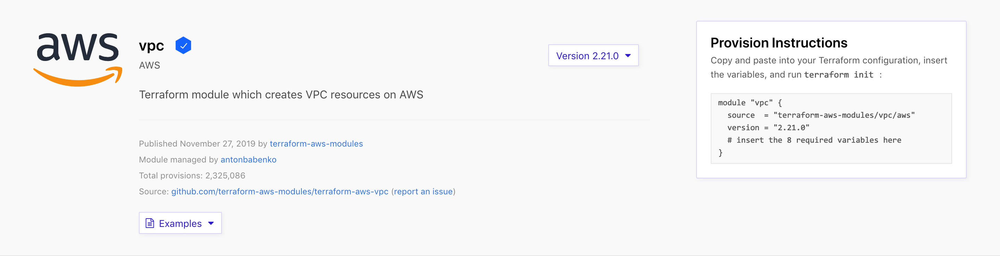

Open `main.tf`{{open}}. 

This configuration includes three blocks:

- The `"aws" provider` defines your provider. This Katacoda scenario uses [localstack](https://localstack.cloud/) to provide a 
testing environment on your local machine that provides the same functionality 
and APIs as the real AWS cloud environment. This way you can learn how to organize
your Terraform configuration without needing an AWS account.

  As a result, the AWS provider block will have additional boilerplate which isn't required for a standard Terraform AWS workflow.
  
  Refer to the [AWS Get Started collection](https://learn.hashicorp.com/tutorials/terraform/aws-build?in=terraform/aws-get-started) or the [AWS Provider Registry page](https://registry.terraform.io/providers/hashicorp/aws/latest/docs#authentication) to learn different ways  to authenticate the AWS provider.
- The `"vpc" module` defines a Virtual Private Cloud (VPC), which will provide networking services for the rest of your infrastructure.
- The `"ec2_instances" module` defines two EC2 instances within your VPC.

## Use the Terraform Registry

Open the [Terraform Registry page for the VPC
module](https://registry.terraform.io/modules/terraform-aws-modules/vpc/aws/2.21.0)
in a new browser tab or window.

You will see information about the module, as well as a link to the source
repository. On the right side of the page, you will see a dropdown interface to
select the module version, as well as instructions to use the module to
provision infrastructure.

When calling a module, the `source` argument is required. In this example,
Terraform will search for a module in the Terraform registry that matches the
given string. You could also use a URL or local file path for the source of your
modules. See the [Terraform
documentation](https://www.terraform.io/docs/modules/sources.html) for a list of
possible module sources.

The other argument shown here is the `version`. For supported sources, the
version will let you define what version or versions of the module will be
loaded. In this tutorial, you will specify an exact version number for the modules
you use. You can read about more ways to specify versions in the [module
documentation](https://www.terraform.io/docs/configuration/modules.html#module-versions).

Other arguments to module blocks are treated as input variables to the modules.