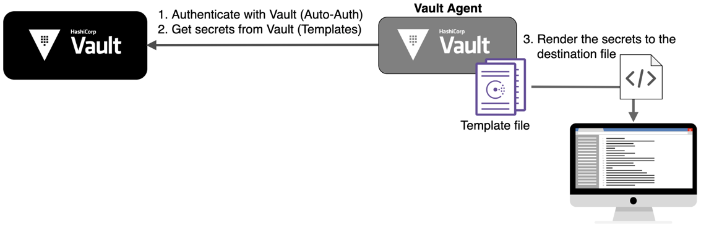

> This scenario supplements the [Vault Agent Templates](https://learn.hashicorp.com/vault/identity-access-management/agent-templates) guide.

The adoption of Vault is an incremental journey. First, you move your secrets into Vault so that they are securely encrypted and stored. The next step is to update your applications' behavior so that the secrets are read from Vault.

[Vault Agent Auto-Auth](https://www.vaultproject.io/docs/agent/index.html) was introduced to reduce the burden from distributed applications to manage Vault client tokens. Once acquired a token, Vault clients can start interacting with the Vault. Many Vault users adopted the [Consul Template](https://releases.hashicorp.com/consul-template/) tool to minimize the level of changes introduced to their existing applications. But they still had to manage those two tools.

In **Vault 1.3**, Vault Agent introduced [Vault Agent Templates](https://www.vaultproject.io/docs/agent/template/index.html) allowing Vault secrets to be rendered to files using the [Consul Template markup](https://github.com/hashicorp/consul-template#templating-language) language. This significantly simplifies the workflow when you are integrating your applications with Vault.

# Prerequisites

This scenario assumes that you have some working knowledge of **Vault Agent** and **Consul Templates**. If you are not familiar with Vault Agent and/or Consul Template, complete the following scenario before continuing with this scenario:

- [Vault Agent](https://www.katacoda.com/hashicorp/scenarios/vault-agent)
- [Direct App Integration](https://www.katacoda.com/hashicorp/scenarios/vault-tools)
