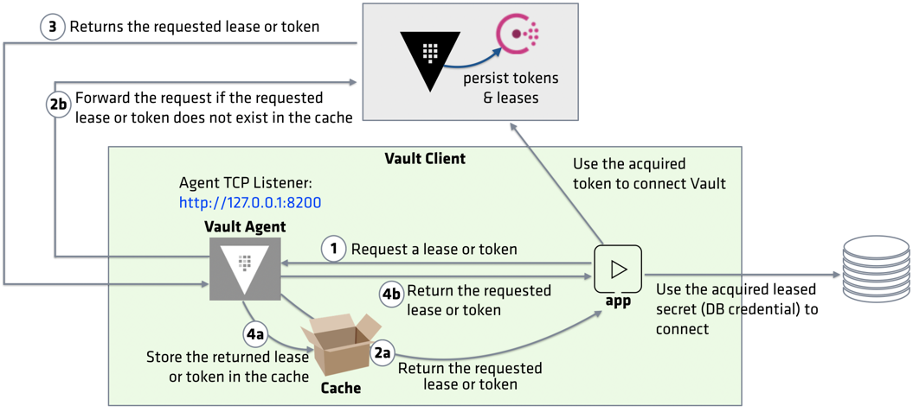

-----

**!!! BEFORE RESUME !!!**

Return to the **Terminal** and press **Ctl + C** to stop the running Vault Agent.  We are going to modify the agent configuration to support Caching.

Clear the terminal: `clear`{{execute T1}}

------

<br>

## Vault Agent Configuration

To enable Vault Agent Caching, the agent configuration file must define `cache` and `listener` stanzas. The `listener` stanza specifies the proxy address which Vault Agent listens. All the requests will be made through this address and forwarded to the Vault server.



Examine the Vault Agent configuration file, `agent-config-caching.hcl`{{open}}.

```
exit_after_auth = false
pid_file = "./pidfile"

auto_auth {
   method "approle" {
       mount_path = "auth/approle"
       config = {
           role_id_file_path = "roleID"
           secret_id_file_path = "secretID"
           remove_secret_id_file_after_reading = false
       }
   }

   sink "file" {
       config = {
           path = "approleToken"
       }
   }
}

cache {
   use_auto_auth_token = true
}

listener "tcp" {
   address = "127.0.0.1:8007"
   tls_disable = true
}

vault {
   address = "http://127.0.0.1:8200"
}
```

In this example, the agent listens to port **8007**.

Execute the following command to start the Vault Agent with `debug` logs.

```
vault agent -config=agent-config-caching.hcl -log-level=debug
```{{execute T1}}

<br>

In the **Terminal 2**, set the `VAULT_AGENT_ADDR` environment variable.

```
export VAULT_AGENT_ADDR="http://127.0.0.1:8007"
```{{execute T2}}

Execute the following command to create a short-lived token and see how agent manages its lifecycle:

```
VAULT_TOKEN=$(cat approleToken) vault token create -ttl=30s -explicit-max-ttl=2m
```{{execute T2}}

For the purpose of demonstration, the generated token has only 30 seconds before it expires. Also, its max TTL is 2 minutes; therefore, it cannot be renewed beyond 2 minutes from its creation.

```
Key                  Value
---                  -----
token                s.qaPOodPTUdtbj5REak2ICuyg
token_accessor       Bov810fwIPlp48bENCuW8xv9
token_duration       30s
token_renewable      true
token_policies       ["token_update" "default"]
identity_policies    []
policies             ["token_update" "default"]
```

Examine the agent log in the first **Terminal**. The log should include the following messages:

```
...
[INFO]  cache: received request: path=/v1/auth/token/create method=POST
[DEBUG] cache.leasecache: forwarding request: path=/v1/auth/token/create method=POST
[INFO]  cache.apiproxy: forwarding request: path=/v1/auth/token/create method=POST
[DEBUG] cache.leasecache: processing auth response: path=/v1/auth/token/create method=POST
[DEBUG] cache.leasecache: setting parent context: path=/v1/auth/token/create method=POST
[DEBUG] cache.leasecache: storing response into the cache: path=/v1/auth/token/create method=POST
[DEBUG] cache.leasecache: initiating renewal: path=/v1/auth/token/create method=POST
[DEBUG] cache.leasecache: secret renewed: path=/v1/auth/token/create
```

The request was first sent to `VAULT_AGENT_ADDR` (agent proxy) and then forwarded to the Vault server (`VAULT_ADDR`). You should find an entry in the log indicating that the returned token was stored in the cache.

Re-run the command and observe the returned token value.

```
VAULT_TOKEN=$(cat approleToken) vault token create -ttl=30s -explicit-max-ttl=2m
```{{execute T2}}

It should be the same token.

The agent log indicates the following:

```
...
[INFO]  cache: received request: path=/v1/auth/token/create method=POST
[DEBUG] cache.leasecache: returning cached response: path=/v1/auth/token/create
```

Continue watching the agent log to see how it manages the token's lifecycle.

```
...
[DEBUG] cache.leasecache: secret renewed: path=/v1/auth/token/create
[DEBUG] cache.leasecache: secret renewed: path=/v1/auth/token/create
[DEBUG] cache.leasecache: secret renewed: path=/v1/auth/token/create
[DEBUG] cache.leasecache: secret renewed: path=/v1/auth/token/create
[DEBUG] cache.leasecache: secret renewed: path=/v1/auth/token/create
```

Vault Agent renews the token before its TTL until the token reaches its maximum TTL (2 minutes). Once the token reaches its max TTL, agent fails to renew it because the Vault server revokes it.

```
[DEBUG] cache.leasecache: renewal halted; evicting from cache: path=/v1/auth/token/create
[DEBUG] cache.leasecache: evicting index from cache: id=1f9d3e6d037d18f1e91b70be9918f95009433bf585252134de6a41a187e873ee path=/v1/auth/token/create method=POST
```

When the token renewal failed, the agent automatically evicts the token from the cache since it's a stale cache.

<br>

## Evict Cached Leases

While agent observes requests and evicts cached entries automatically, you can trigger a cache eviction by invoking the `/agent/v1/cache-clear` endpoint.

To evict a lease, invoke the `/agent/v1/cache-clear` endpoint along with the ID of the lease you wish to evict.

```
curl -X POST -d '{"type": "lease", "value": "<lease_id>"}' \
       $VAULT_AGENT_ADDR/agent/v1/cache-clear
```

If a situation requires you to clear all cached tokens and leases (e.g. reset after a number of testing), set the type to all.

```
curl -X POST -d '{"type": "all"}' $VAULT_AGENT_ADDR/agent/v1/cache-clear
```{{execute T2}}

In the agent log, you find the following:

```
[DEBUG] cache.leasecache: received cache-clear request: type=all namespace= value=
[DEBUG] cache.leasecache: canceling base context
[DEBUG] cache.leasecache: successfully cleared matching cache entries
```
