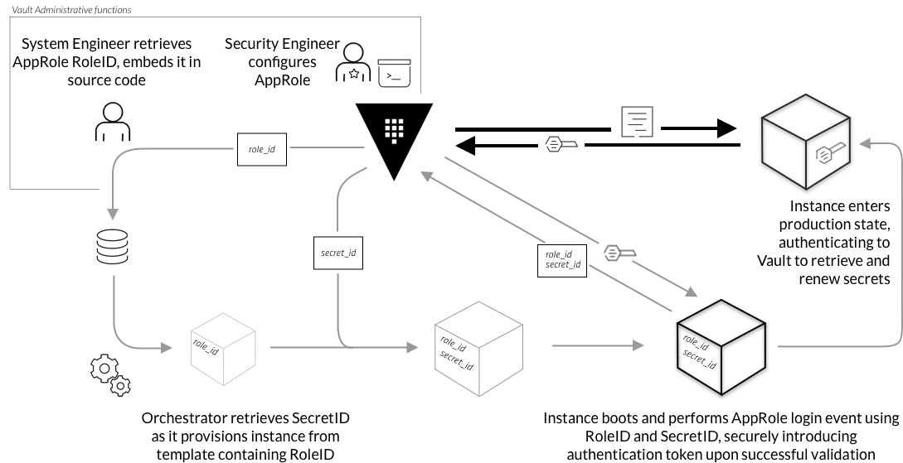

## Overview

Before a client can interact with Vault, it must authenticate against an [auth method](https://www.vaultproject.io/docs/auth/index.html). Auth methods perform authentication to verify the user or machine-supplied information. Some of the supported auth methods are targeted towards human users while others are targeted toward machines or apps. Upon authentication, a token is generated. This token is conceptually similar to a session ID on a website. The token may have attached policy, which is mapped at authentication time.

> This scenario supplements the [AppRole Pull Authentication(https://learn.hashicorp.com/vault/identity-access-management/iam-authentication)) guide.

## AppRole Auth Method

The [approle auth method](https://www.vaultproject.io/docs/auth/approle.html) allows machines or apps to authenticate with Vault-defined roles.

This Katacoda scenario walks through the basics of AppRole auth method.
