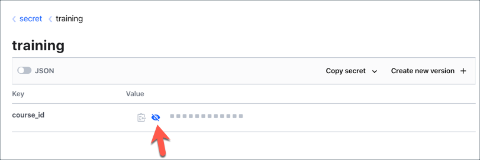
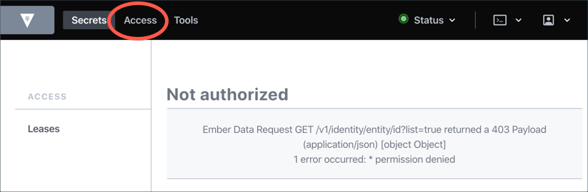

Authenticate using the username and password you just created.

The command would be:

```
vault login -method=userpass username=<user_name> password=<password>
```

Execute the following command to login:

```
vault login -method=userpass username="student01" password="training"
```{{execute T1}}

When you successfully authenticate with Vault using your username and password, Vault returns a **token**.  From then on, you can use this token to make API calls and/or run CLI commands.


You should be able to execute the following command successfully:

```
vault kv put secret/training course_id="Vault-101"
```{{execute T1}}

However, the `base` policy does not grant any permission on `sys/policy` that the following command will throw **permission denied** error:

```
vault policy read base
```{{execute T1}}

<br>

## Vault UI

Now, let's explore the Vault UI.

1. Click on the **Vault UI** tab to launch the Vault UI.

  

1. Select **Username** from the **Method** drop-down list, and enter `student01` in the **Username** text field and `training` in the **Password** text field.

1. Select **secret > training**. Click the sensitive data toggle to show or hide the `course_id` value.

  

1. Click **Create new version** allows you to update the secrets at `secret/training`.

1. Click the **Access** tab. You should see the **Not authorized** message. This is because the `base` policy does not allow you to perform any operation under this tab.

  

> To learn more about Vault policies, check out the [Vault ACL Policies](https://www.katacoda.com/hashicorp/scenarios/vault-policies) scenario.
