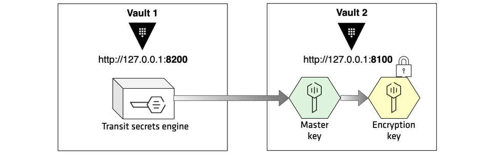

To enable **Transit Auto-Unseal**, you would need **two** Vault servers.




Open the `config-vault-1.hcl`{{open}} file to review the server configuration file for **Vault 1**:

```
disable_mlock = true
ui=true

storage "file" {
  path = "~/vault-1/data"
}

listener "tcp" {
  address     = "0.0.0.0:8200"
  tls_disable = 1
}
```


For the purpose of demonstration, the **file** storage backend stores Vault's data on the filesystem using a standard directory structure (`/vault-1/data`) in this example.

The `listener` stanza specifies the TCP address/port that Vault listens to for incoming requests, and **Vault 1** listens to port **8200**.

Execute the following command to start the **Vault 1** server:

```
vault server -config=config-vault-1.hcl
```{{execute T1}}

Notice the output indicating that the **Storage** is set to `file` system, and the **Listener** address is `0.0.0.0:8200`.

```
==> Vault server configuration:

             Cgo: disabled
      Listener 1: tcp (addr: "0.0.0.0:8200", cluster address: "0.0.0.0:8201", max_request_duration: "1m30s", max_request_size: "33554432", tls: "disabled")
       Log Level: info
           Mlock: supported: true, enabled: false
         Storage: file
         Version: Vault v1.1.1
     Version Sha: a3dcd63451cf6da1d04928b601bbe9748d53842e
```
<br>

Click the **+** next to the opened Terminal, and select **Open New Terminal**.


Execute the following command to initialize the Vault.

```
export VAULT_ADDR="http://127.0.0.1:8200"
vault operator init -key-shares=1 -key-threshold=1 > key.txt
```{{execute T2}}

Execute the `vault operator unseal` command to enter the first unseal key:

```
vault operator unseal \
    $(grep 'Key 1:' key.txt | awk '{print $NF}')
```{{execute T2}}

Log into Vault using the **initial root token** (`key.txt`{{open}}):

```
vault login $(grep 'Initial Root Token:' key.txt | awk '{print $NF}')
```{{execute T2}}


Next, you are going to setup a `transit` secrets engine in **Vault 1**.
