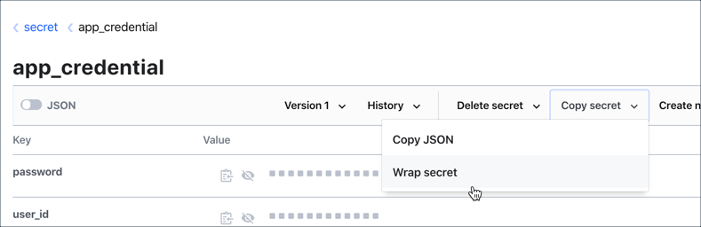
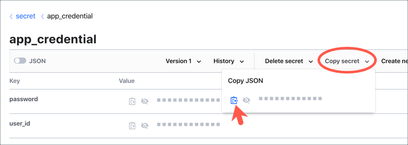
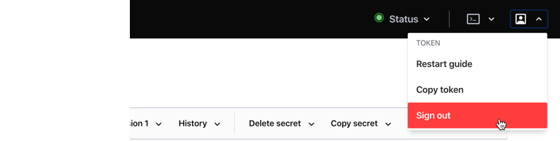
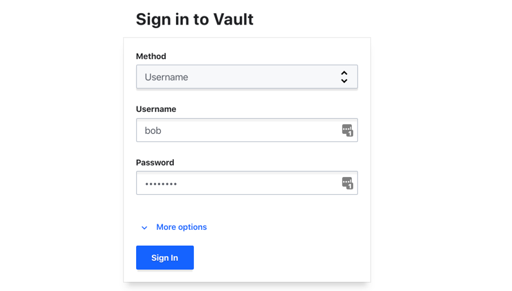
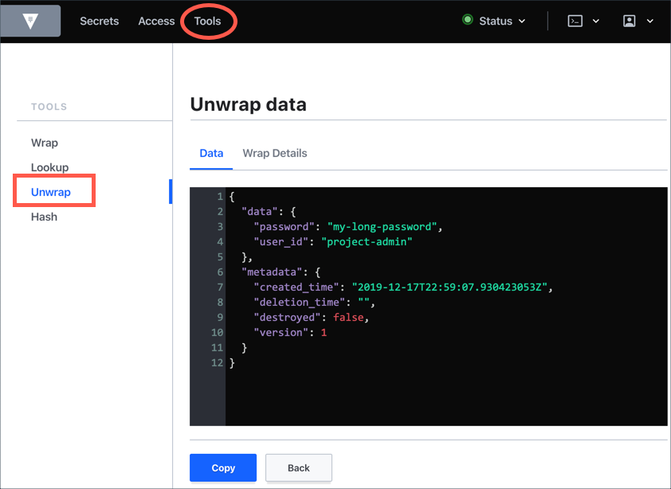

Enable the `userpass` auth method.

```
vault auth enable userpass
```{{execute T1}}

Create a user, "bob" with only the `default` policy attached. The password is "password".

```
vault write auth/userpass/users/bob password="password" policies="default"
```{{execute T1}}

<br>

# Web UI

1. Click on the **Vault UI** tab to launch the Vault UI.

  

1. Enter **`root`** in the **Token** text field and then click **Sign In**.

1. Select **secret > app_credential**.

1. Select **Copy secret > Wrap secret**.

  

1. Copy the wrapping token.

  

1. Sign out of the UI.

  

1. Select **Username** under **Method**, enter `bob` in the **Username** text field, and `password` in the **Password** field.

  

1. Click **Sign In**.  

  > Notice that "bob" only has a visibility to the Cubbyhole secrets engine.

1. Select **Tools** and then **Unwrap**.

1. Enter the wrapping token value you copied earlier in the **Wrapping token** field, and then click **Unwrap data**.

  

1. Sign out of the UI.

# Summary

When you need to pass secrets to someone who does not have access to the secret path or even Vault, use the response wrapping. The wrapping token is a reference to the secret location; therefore, you don't have to send the secrets over the public network. In fact, the secrets remain within the Vault.
