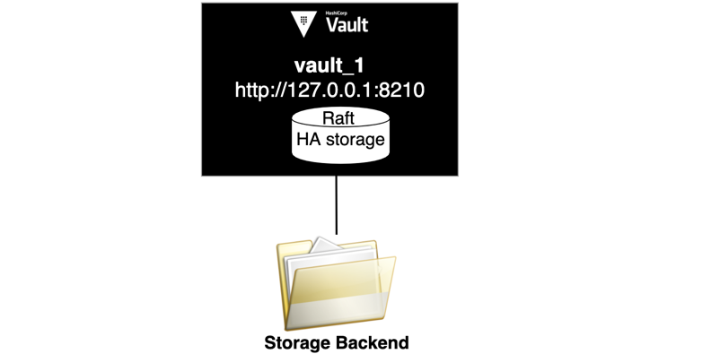

<div style="background-color:#fbe5e5; color:#864242; border:1px solid #f8cfcf; padding:1em; border-radius:3px; margin:24px 0;">
<p>
Wait until the initial setup completes before start.
</p></div>

<br />


You have a Vault server which uses filesystem as its storage backend. Since filesystem storage backend does not support HA, you have a single node deployment.


### Start Vault Server 1 (node1)

First review the server configuration file, `config-node1.hcl`{{open}}.

The `storage` stanza is set to use `file`.


Enter the following command to start the `node1` Vault server.  

```
mkdir vault-storage-file
vault server -config=config-node1.hcl
```{{execute T1}}


Click the **+** next to the opened Terminal, and select **Open New Terminal**.


In the **Terminal 2**, set the `VAULT_ADDR` environment variable to point to `http://127.0.0.1:8210`.

```
export VAULT_ADDR="http://127.0.0.1:8210"
```{{execute T2}}


The server status shows that **HA Enabled** is `false` since `file` storage backend does not support HA.

```
vault status
```{{execute T2}}

Stop the Vault server.

```
ps aux | grep "vault server" | grep -v grep | awk '{print $2}' | xargs kill
```{{execute T2}}

<br />

## Update the server configuration

When you need to use a storage backend that does not support HA, `ha_storage` stanza can be specified along with the `storage` stanza in the Vault server configuration to handle the HA coordination. By doing so, you can add additional Vault nodes for fault tolerance.

> **NOTE:** The `ha_storage` must be an HA-supporting storage backend.

Open `config-node1.hcl`{{open}} and add `raft` as your `ha_storage` for node1.

<pre class="file" data-filename="config-node1.hcl" data-target="append">
# Use the file system as storage backend
ha_storage "raft" {
  path    = "/root/raft-node1/"
  node_id = "node1"
}
</pre>

Now, start `node1` with updated server configuration.

```
mkdir raft-node1
vault server -config=config-node1.hcl
```{{execute T1}}

The server status shows that **HA Enabled** is `true`.

```
vault status
```{{execute T2}}

Execute the `vault operator init` command to initialize `node1`.

```
vault operator init -key-shares=1 -key-threshold=1 > key.txt
```{{execute T2}}

> **NOTE:** For the simplicity, setting the number of unseal keys to `1` as well as the key threshold, and storing the generated unseal key and initial root token in a local file named, `key.txt`{{open}}.


Unseal `node1` with unseal key.

```
vault operator unseal $(grep 'Key 1:' key.txt | awk '{print $NF}')
```{{execute T2}}

In **Terminal**, wait until you see `core: post-unseal setup complete` message in the system log.

```
...
[INFO]  core.raft: creating new raft TLS config
[INFO]  core: usage gauge collection is disabled
[INFO]  core: post-unseal setup complete
```

<div style="background-color:#fcf6ea; color:#866d42; border:1px solid #f8ebcf; padding:1em; border-radius:3px;">
<p><strong>NOTE: </strong>
Wait until you see the log message, `[INFO]  core: post-unseal setup complete` to continue.
</p></div>


Log into Vault using the **initial root token** (`key.txt`{{open}}):

```
vault login $(grep 'Initial Root Token:' key.txt | awk '{print $NF}')
```{{execute T2}}

Execute the following command to view the node1's Raft cluster configuration.

```
vault operator raft list-peers
```{{execute T2}}

```
Node     Address           State     Voter
----     -------           -----     -----
node1    127.0.0.1:8211    leader    true
```

You successfully enabled HA storage to store the HA coordination information.


