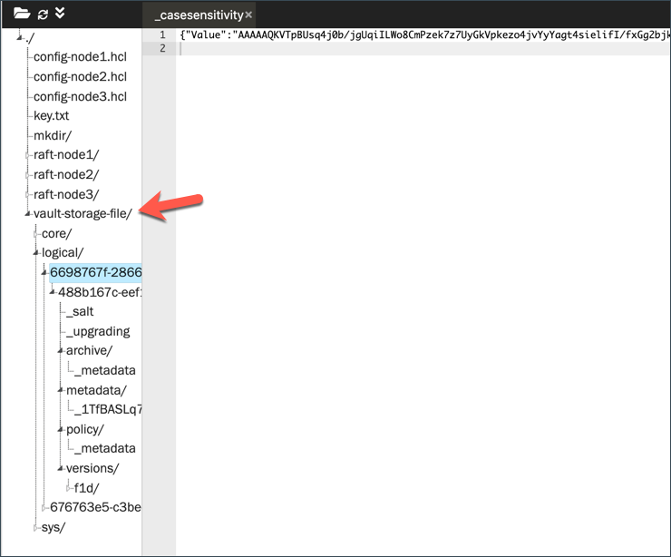

Let's enable K/V secrets engine.

```
vault secrets enable -path=secret kv-v2
```{{execute T2}}


Create some secrets.

```
vault kv put secret/credentials user_id="student" passcode="vaultrocks"
```{{execute T2}}


The Vault data is stored in the filesystem as configured in the storage stanza (`/home/scrapbook/tutorial/vault-storage-file`). Therefore, you can find the encrypted data under the `/home/scrapbook/tutorial/vault-storage-file/logical` folder.



```
cd vault-storage-file
tree
```{{execute T2}}

<br>

## Step down node1

See what happens when node1 steps down as a leader.

```
vault operator step-down
```{{execute T2}}

Check the raft peer set.

```
vault operator raft list-peers
```{{execute T2}}

```
Node     Address           State       Voter
----     -------           -----       -----
node1    127.0.0.1:8211    follower    true
node2    127.0.0.1:8221    leader      true
node3    127.0.0.1:8231    follower    true
```

Now, node2 becomes the leader.

You have successfully converted a single-node Vault server (`node1`) into a three-nodes Vault cluster.
