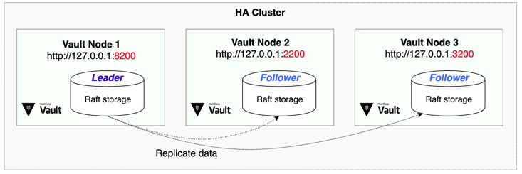

This hands-on exercise will walk you through the basic administrative operations for integrated storage. You are going to deploy an HA Vault cluster using integrated storage.

 

## Additional resources on Vault's Integrated Storage

- [Vault with Integrated Storage Reference Architecture](https://learn.hashicorp.com/vault/operations/raft-reference-architecture)
- [Preflight Checklist: Migrating to Integrated Storage](https://learn.hashicorp.com/vault/operations/storage-migration-checklist)
- [Storage Migration Guide - Consul to Integrated Storage](https://learn.hashicorp.com/vault/operations/migrate-to-raft)
- [Vault HA Cluster with Integrated Storage](https://learn.hashicorp.com/vault/operations/raft-storage)
- [Vault HA Cluster with Integrated Storage on AWS](https://learn.hashicorp.com/vault/operations/raft-storage-aws)
