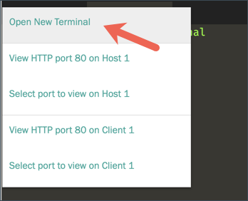

Click the **+** next to the opened Terminal, and select **Open New Terminal** to start third terminal (**Terminal 3**).



Open the `node2` server configuration file, `config-node2.hcl`{{open}}.

```
storage "raft" {
  path    = "/root/raft-node2/"
  node_id = "node2"
}

listener "tcp" {
  address = "127.0.0.1:2200"
  cluster_address = "127.0.0.1:2201"
  tls_disable = true
}

disable_mlock = true
api_addr = "http://127.0.0.1:2200"
cluster_addr = "http://127.0.0.1:2201"
```

Notice that the `node_id` is set to `node2` and this server will listen to port **`2200`**.

Execute the following command to start `node2`:

```
mkdir raft-node2
vault server -config=config-node2.hcl
```{{execute T3}}

```
==> Vault server configuration:

             Api Address: http://127.0.0.1:2200
                     Cgo: disabled
         Cluster Address: https://127.0.0.1:2201
               ...snip...
```

You can verify that the **Api Address** is `http://127.0.0.1:2200`.  

<br />

## Join the Cluster

Click the **+** next to the opened Terminal, and select **Open New Terminal** to start fourth terminal (**Terminal 4**).


In **Terminal 4**, set the VAULT_ADDR to `http://127.0.0.1:2200`.

```
export VAULT_ADDR='http://127.0.0.1:2200'
```{{execute T4}}

Check the `node2` server status:

```
vault status
```{{execute T4}}

Now, you are going to use `vault operator raft` command to join `node2` to `node1` Raft cluster.  Execute the `vault operator raft join` command.

```
vault operator raft join http://127.0.0.1:8200
```{{execute T4}}

Where `http://127.0.0.1:8200` is the API address of `node1`.

```
Key       Value
---       -----
Joined    true
```

> **NOTE:** By joining the cluster, `node2` becomes the **standby** node.

Check the `node2` server status again.

```
vault status
```{{execute T4}}

```
Key                Value
---                -----
Seal Type          shamir
Initialized        true
Sealed             true
Total Shares       1
Threshold          1
Unseal Progress    0/1
...snip...
```

Notice that the `node2` is now initialized, but **Unsea. Progress** status is `0/1`.

<div style="background-color:#fcf6ea; color:#866d42; border:1px solid #f8ebcf; padding:1em; border-radius:3px;">
<p><strong>NOTE: </strong>
When using the Shamir's secret sharing algorithm, the joined node will still need to be unsealed manually.
</p></div>


```
vault operator unseal $(grep 'Key 1:' key.txt | awk '{print $NF}')
```{{execute T4}}

Once Vault is unsealed, you can login using the root token.

```
vault login $(grep 'Initial Root Token:' key.txt | awk '{print $NF}')
```{{execute T4}}

Execute the following command to list the raft peer set.

```
vault operator raft list-peers
```{{execute T4}}

```
Node     Address           State       Voter
----     -------           -----       -----
node1    127.0.0.1:8201    leader      true
node2    127.0.0.1:2201    follower    true
```

You should see both `node1` and `node2` listed.

At this point, you have two-node cluster.  Let's continue and add `node3` to this cluster.
