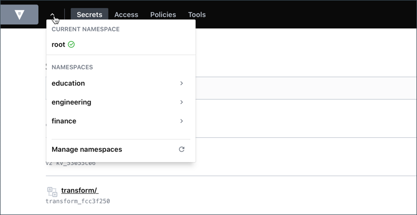

Verify to make sure that Vault has been configured as defined in the `main.tf`.

List existing transformations.

```
vault list transform/transformation
```{{execute T1}}

Read the `ccn-fpe` transformation details.

```
vault read transform/transformation/ccn-fpe
```{{execute T1}}

List existing transformation templates.

```
vault list transform/template
```{{execute T1}}

Read the `ccn` transformation template definition.

```
vault read transform/template/ccn
```{{execute T1}}

<br />

## Launch Vault UI

Click on the **Vault UI** tab to launch the Vault UI.


Enter `root` in the **Token** text field and click **Sign in**.

Verify that `finance` and `engineering` namespaces exist. The green check-mark indicates that you are currently logging into the `root` namespace.



Switch to the **engineering** namespace and verify that `admins` policy exists.


Select the `education` namespace and verify that `training` namespace exists.


Select the `training` namespace and verify that `vault_cloud` and `boundary` namespaces exist.


Switch to the **finance** namespace and verify that `kv-v2` secrets engine is enabled.


Click the **Policies** tab to verify that `admin` policy exists.

Now, return to the **root** namespace and verify that `transform` secrets engine is enabled.


Click the **Policies** tab. Verify that `admins` and `fpe-client` policies exist.


Sign out of the Vault UI.


In the sign in page, select **Username** auth method, enter `student` in the **Username** text field, and `changeme` in the **Password** text field.


Click the Vault CLI shell icon (`>_`) to open a command shell. Execute `vault write transform/encode/payments value=1111-2222-3333-4444` to verify that the user, `student` can encode a credit card number using the payment role.


