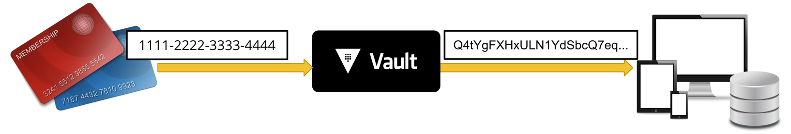

In Vault 1.6, transform secrets engine introduced a new data transformation
method to **tokenize** sensitive data stored outside of Vault. Tokenization
replaces sensitive data with unique values (tokens) that are unrelated to the
original value in any algorithmic sense. Therefore, those tokens cannot risk
exposing the plaintext satisfing the PCI-DSS guidance.

