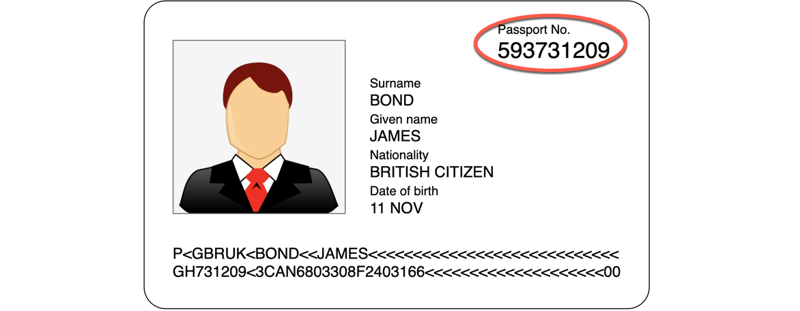

British passport numbers have a pattern of 9 digit numbers.



Use regex to define the matching pattern, `(\d{9})`. The matched values should be within a regex grouping (e.g. `(...)`). To create a template for British passports, the commands would look as below.

```
vault write transform/template/uk-passport-tmpl type=regex \
        pattern="(\d{9})" \
        alphabet=builtin/numeric
```{{execute T1}}

> **NOTE:** This example uses the built-in alphabet, `builtin/numeric`.

<br />

## Test

Create a transformation named "uk-passport" containing the `uk-passport-tmpl` template.

```
vault write transform/transformation/uk-passport type=fpe \
        template=uk-passport-tmpl tweak_source=internal \
        allowed_roles=*
```{{execute T1}}

Update the `payments` role to include the `uk-passport` transformation as well. Alternatively, you can create a new role instead.

```
vault write transform/role/payments transformations=card-number,uk-passport
```{{execute T1}}

In this case, you must specify which `transformation` to use when you send an encode request since the `payments` role has two transformations associate with it.

```
vault write transform/encode/payments value="123456789" transformation=uk-passport
```{{execute T1}}
