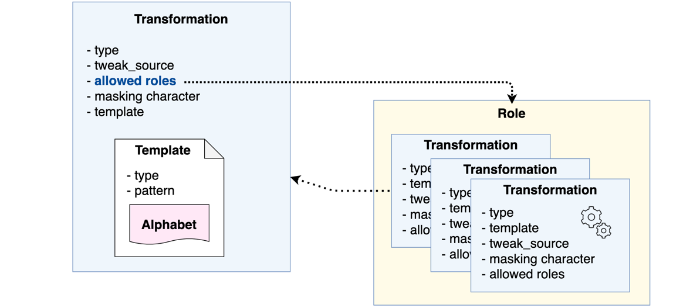

> **Important Note:** Without a valid license, Vault Enterprise server will be sealed after ***30 minutes***. To explore Vault Enterprise further, you can [sign up for a free 30-day trial](https://www.hashicorp.com/products/vault/trial).

Transform secrets engine configuration workflow:

  1. Enable the `transform` secrets engine
  1. Create a **role** containing the transformations that it can perform
  1. Create an alphabet defining a set of characters to use for format-preserving encryption (FPE) if not using the built-in alphabets.
  1. Create a template defining the rules for value matching if not using the built-in template
  1. Create a **transformation** to specify the nature of the data manipulation



**Alphabets** define a set of valid input/output UTF-8 characters to be used when you perform FPE. In this step, you are going to leverage one of the built-in alphabets.

Data transformation **templates** are constructed of **type** (`regex`), **pattern** ([regex
expression](https://en.wikipedia.org/wiki/Regular_expression)) and allowed **alphabet** used in the input value. Currently, regex is the only supported type. The pattern defines the data format pattern. For example, the most credit card numbers would have a  pattern that can be expressed as
`(\d{4})-(\d{4})-(\d{4})-(\d{4})` in regex.

**Transformations** define the transformation **type** (`fpe` or `masking`), **template**, **tweak source** or the masking character to be used to transform the secrets.

## Tweak source types:

| Source      | Description                                               |
|-------------|-----------------------------------------------------------|
| supplied (default)   | User provide the tweak source which must be a base64-encoded string |
| generated   | Vault generates and returns the tweak source along with the encoded data. The user must securely store the tweak source which will be needed to decrypt the data |
| internal    | Vault generates a tweak source for the transformation and the same tweak source will be used for every request |

> **NOTE:** Tweak source is only applicable to the FPE transformation.

<br />

Let's begin!  First, login with root token.

> Click on the command (`⮐`) will automatically copy it into the terminal and execute it.

```
vault login root
```{{execute T1}}

Execute the following command to enable the `transform` secrets engine at `transform/`.

```
vault secrets enable transform
```{{execute T1}}

## Create a role

Create a role named "payments" with "card-number" transformation attached which you will create next.

```
vault write transform/role/payments transformations=card-number
```{{execute T1}}

To list existing roles, execute the following command.

```
vault list transform/role
```{{execute T1}}

## Create a transformation

Create a transformation named "card-number" which will be used to transform credit card numbers. This uses the built-in `builtin/creditcardnumber` template to perform format-preserving encryption (FPE). The allowed role to use this transformation is `payments` you just created.

```
vault write transform/transformation/card-number type=fpe \
        template="builtin/creditcardnumber" \
        tweak_source=internal \
        allowed_roles=payments
```{{execute T1}}

**NOTE:** The `allowed_roles` parameter can be set to a wildcard (`*`) instead of listing role names. Also, the role name can be expressed using globs at the end for pattern matching (e.g. `pay*`).


To list the existing transformations, execute the following command.

```
vault list transform/transformation
```{{execute T1}}

To view the details of the newly created `card-number` transformation, execute the following command.

```
vault read transform/transformation/card-number
```{{execute T1}}
