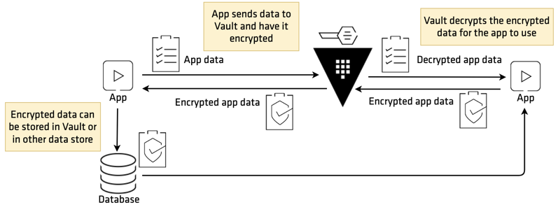

> This scenario supplements the [Encryption as a Service: Transit Secrets Engine](https://learn.hashicorp.com/vault/encryption-as-a-service/eaas-transit) guide.

[HashiCorp Vault](https://www.vaultproject.io)'s `transit` secrets engine handles cryptographic functions on data in-transit. It can also viewed as _encryption as a service_.  

> **NOTE:** Vault does *not* store the data sent to the secrets engine.  

The primary use case for the `transit` secrets engine is to encrypt data from applications while still storing that encrypted data in some primary data store. This relieves the burden of proper encryption/decryption from application developers and pushes the burden onto the operators of Vault.

 
This scenario demonstrates the usage of `transit` secrets engine:

- Configure Transit Secrets Engine
- Encrypt Secret
- Rotate the Encryption Key
- Rewrap Data
- Update Key Configuration
