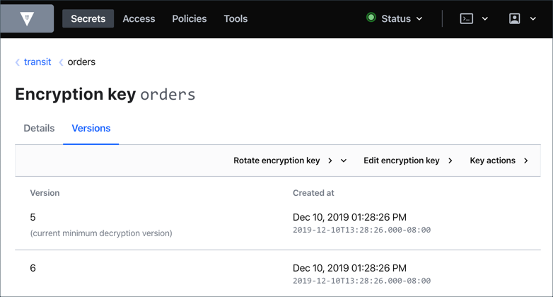

Let's explore the Vault UI.

1. Click on the **Vault UI** tab to launch the Vault UI.

  

1. Enter **`root`** in the **Token** text field to sign in.

1. Select **transit > orders**.

1. Select the **Versions** tab which displays only the valid versions of the key.

  

1. Select the **Key action**.

1. With **Encrypt** selected, enter some text in the **Plaintext** field (e.g. `my-long-secrets`).

1. Click **Encode to base64**, and then **Encrypt**. This returns you the ciphertext.

> **NOTE:** To learn more about the `transit` secrets engine, visit to the [Vault Encryption as a Service](https://www.katacoda.com/hashicorp/scenarios/vault-transit) tutorial.
